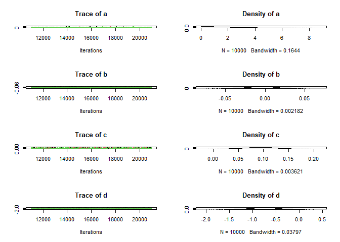
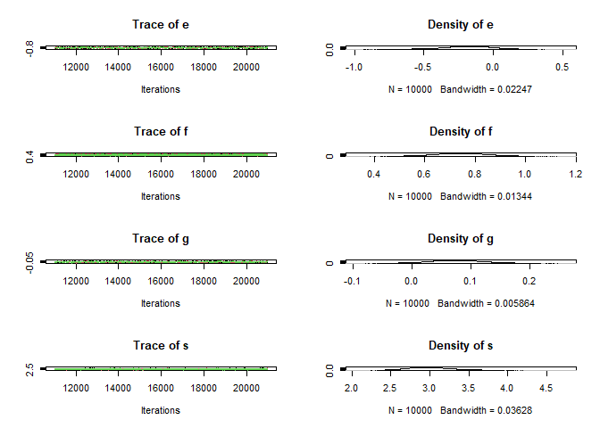
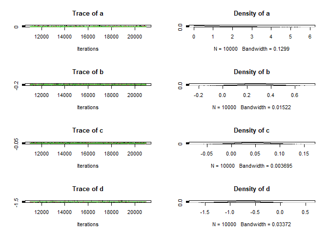
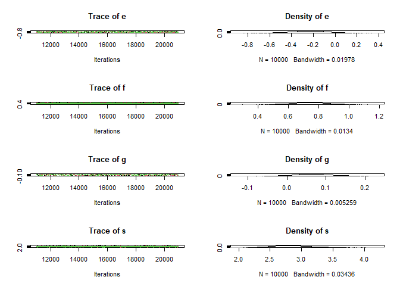
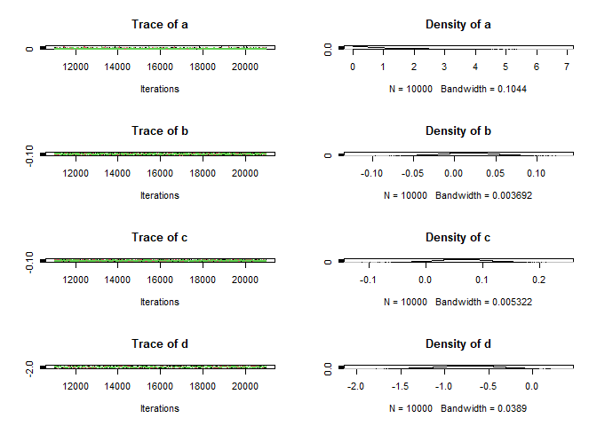

ST417 Bayesian Modelling Project
================
Fionn McGlacken 19388186, Alex Horkan 19461736, Hugo Mead 19419556
2023-01-06

# Introduction

This project was completed for ST417 Introduction to Bayesian Modelling.
It was developed on github

<https://github.com/Fionn-McGlacken/ST417-Bayesian-Modelling-Project>

# Aim

## Research question:

What are the distributions of time, distance, and cost of travel for
University of Galway students, and how do they vary with respect to
confounding variables such as weather, day, time, traffic, age, city or
town, and mode of transport?

## Motivation:

We are in an accommodation crisis. Third-level students without access
to accommodation near their universities commute longer hours, over
greater distances, at higher costs. We want to understand this
empirically.

## Background Information

The target population of our study is University of Galway students. The
data used in our study was surveyed from University of Galway students.
We collected data on time, distance, cost, weather, day, time, traffic,
age, location and mode of transport.

## List of Aims

In order to explore the effects of the different variables associated
with commuting, we have set a list of aims we wish to explore throughout
the project.

1.  Investigate the relationship between time, distance, and commuting
    costs.
2.  Investigate the effects of confounding variables, such as weather,
    day, time, traffic, age, and mode of transport.
3.  Calculate point and interval estimates of time, distance, and cost
    to travel.
4.  Investigate if the average time, distance, and cost of travel for
    students have increased over previous years.
5.  Investigate the most expensive city or town to travel from, on
    average.
6.  Investigate prevailing weather, the most common mode of transport,
    and traffic patterns.
7.  Estimate the carbon footprint of travel for University of Galway
    students.
8.  Compare differences between year groups and see which year has the
    greatest travel times.

# Data and Prior Description

## Subjective Opinion

In our opinion, the time, distance and commuting costs should be the
easiest to analyse as they are the most straightforward variables to
measure. We believe that the confounding variables will be more
difficult to analyse as they are harder to measure. For example, weather
and traffic data must be sourced online.

## Data Sampling

### Survey

The data we used for the purposes of this analysis was collected via an
online questionnaire which was distributed amongst University of Galway
students.

<https://docs.google.com/forms/d/1aJ-uViRoRLn2aS7wT3EdJs-szgU1ARKo895fsDlbGL4/edit>

We asked students what they think the average time, cost, distance, mode
of transport for students is to inform our prior distributions. Then, we
asked students about the time, cost, distance and mode of transport in
their travel to university to inform the likelihood distributions. We
also asked students about their yeargroup and origin.

We received a total of 74 responses comprised mostly of 3rd and 4th-year
students, with the remaining being made up of 1st and 2nd-year as well
as postgraduate students.

### Additional Data

We collected additional weather data online. Unfortunately, we could not
find reliable traffic data.

## Limitations: Issues in Data Sampling

There were some issues collecting data:

### Biased Data

Firstly, it was easiest to collect data from students we know. This
means that our data is not representative of the entire student
population. For example, 3rd and 4th year students are overrepresented
in our study. Additionally, it may be the case that students who are
most affected by the commuting crisis are not present in this study as
they were not accessible. Therefore, results may be more positive than
in reality.

### Messy Data

Secondly, we did not impose any constraints on how students can enter
the data. This lead to a lot of messy data that needed to be cleaned.
For example, one student wrote ‘half an hour to 40 minutes’ for commute
time. To analyse this, the value must be converted to the mean of the
range.

### Missing Traffic Data

We could not find reliable traffic data online.

``` r
data <- read.csv("data.csv")

# est short for estimated
# naming columns
new_names <- c(
  "timestamp",
  "est_time",
  "est_distance",
  "est_cost",
  "est_transport",
  "year_group",
  "time",
  "start_time",
  "distance",
  "cost",
  "transport",
  "origin")

colnames(data) <- new_names
```

## Cleaning Data

### Functions for Cleaning Data

Defining functions to clean data.

``` r
# removes letters from entries
strip_data <- function(column) {
  matcher <- "[^0-9.-]"
  cond <- grepl(matcher, column)
  stripped_rows <- str_remove_all(column[cond], matcher)
  column[cond] <- stripped_rows
  return(column)
}

# removes letters and scales entries by scalar e.g. '80 cents' to '0.8' (euro)
scale_data <- function(column, to_match, scalar) {
  matcher <- paste(to_match, collapse = "|")
  cond <- grepl(matcher, column)
  stripped_rows <- str_remove_all(column[cond], "[^0-9.-]")
  stripped_rows <- as.numeric(stripped_rows)
  column[cond] <- stripped_rows * scalar
  return(column)
}

# replaces range entries by average of range e.g. '7-10' to '8.5'
avg_range <- function(column) {
  matcher <- "^(\\d+)-(\\d+)$"
  cond <- grepl(matcher, column)
  column[cond] <- rowMeans(read.table(text = column[cond],
     sep = "-", header = FALSE), na.rm = TRUE)
  return(column)
}

# replaces range entries by scaled average of range
# e.g. '2-4hrs' to '180' (minutes)
scale_and_avg_range <- function(column, to_match, scalar) {
  matcher <- paste(to_match, collapse = "|")
  cond <- grepl(matcher, column)
  stripped_rows <- str_remove_all(column[cond], to_match)
  table <- read.table(text = stripped_rows, sep = "-", header = FALSE) * scalar
  column[cond] <- rowMeans(table, na.rm = TRUE)
  return(column)
}
```

### Cleaning Data

``` r
data <- data %>% mutate(timestamp = as.Date(timestamp))
data <- data %>% mutate(day = weekdays(timestamp))

data$est_time <- sub("to", "-", data$est_time)
data$est_time <- sub("half an hour", "30", data$est_time)
hours <- c("hours", "hrs")
data$est_time <- scale_and_avg_range(data$est_time, hours, 60)
data$est_time <- strip_data(data$est_time)
data$est_time <- avg_range(data$est_time)
data <- data %>% mutate(est_time = as.numeric(est_time))

data$est_distance <- sub("or", "-", data$est_distance)
data$est_distance <- strip_data(data$est_distance)
data$est_distance <- avg_range(data$est_distance)
data <- data %>% mutate(est_distance = as.numeric(est_distance))
```

    ## Warning in mask$eval_all_mutate(quo): NAs introduced by coercion

``` r
data$est_cost <- sub("/", "-", data$est_cost)
cents <- c("cents")
data$est_cost <- scale_data(data$est_cost, cents, 0.01)
data$est_cost <- strip_data(data$est_cost)
data$est_cost <- avg_range(data$est_cost)
data <- data %>% mutate(est_cost = as.numeric(est_cost))

data$time <- strip_data(data$time)
data <- data %>% mutate(time = as.numeric(time))
data$start_time <- as.POSIXct(paste(data$timestamp, data$start_time)
                                    , format = "%Y-%m-%d %H:%M")

# value entered in wrong column
data[52, 9] <- data[52, 10]
data$distance <- sub("Less than a kilometre", "1", data$distance)
data$distance <- strip_data(data$distance)
data <- data %>% mutate(distance = as.numeric(distance))

data[52, 10] <- NA
data[63, 10] <- "0"
zeros <- c("Nothing", "None")
for (i in zeros) {
  data$cost <- sub(i, "0", data$cost)
}
data$cost <- gsub("Less than a kilometre", paste(zeros, collapse = "|")
                  , data$cost)
costs <- c("cent")
data$cost <- scale_data(data$cost, costs, 0.01)
data[3, 10] <- 0.8
data <- data %>% mutate(cost = as.numeric(cost))
```

    ## Warning in mask$eval_all_mutate(quo): NAs introduced by coercion

``` r
# cleaned data
write.csv(data, "cleaned_data.csv")
```

Next, excel was used to clean location data and add weather data.

``` r
data <- read.csv("origin_weather_data.csv")
head(data)
```

    ##   X  timestamp est_time est_distance est_cost est_transport year_group time
    ## 1 1 21/11/2022       30            3      3.0   Bus / Coach          4   10
    ## 2 2 21/11/2022       15           20      5.0   Bus / Coach          3   15
    ## 3 3 21/11/2022       30           10      0.8           Car          3   25
    ## 4 4 21/11/2022       15           10      3.0          Walk          3    5
    ## 5 5 21/11/2022       15            3      1.5   Bus / Coach          3   20
    ## 6 6 21/11/2022       20           10      6.0   Bus / Coach          2   10
    ##         start_time distance cost   transport               origin    day
    ## 1 21/11/2022 12:45      0.6  0.0        Walk  Eyre square, Galway Monday
    ## 2 21/11/2022 13:40      2.0  0.0        Walk       Galway, Galway Monday
    ## 3 21/11/2022 11:00      5.0  0.8 Bus / Coach       Galway, Galway Monday
    ## 4 21/11/2022 02:50      5.0  0.0         Car       Galway, Galway Monday
    ## 5 21/11/2022 11:45      4.5  1.2 Bus / Coach Knocknacarra, Galway Monday
    ## 6 21/11/2022 11:00     10.0  2.0 Bus / Coach       Galway, Galway Monday
    ##   temp_celcius precipitation_mm perc_humidity wind_kmh  weather
    ## 1            9                7          0.76     36.0    Light
    ## 2            9                7          0.72     36.0    Light
    ## 3            8                7          0.76     36.0 Moderate
    ## 4            9                7          0.72     36.0    Light
    ## 5            8                7          0.76     50.4 Moderate
    ## 6            9                7          0.76     50.4 Moderate

## Data Analysis

Our data can be divided into three sections - Estimated data (to inform
priors) - Actual data (to inform likelihoods) - Participant data (to
measure confounds)

We have four estimates (est) to inform our priors - est_time -
est_distance - est_cost - est_transport

We have four types of actual data to inform our likelihoods - time -
distance - cost - transport

We have 10 types of participant data to measure confounds - timestamp -
year_group - start_time - origin - day - temp_celcius -
precipitation_mm - perc_humidity - wind_kmh - weather (light, moderate,
heavy)

### Time

#### est_time

est_time is the estimated average commute time.

``` r
est_time <- na.omit(data$est_time)
summary(est_time)
```

    ##    Min. 1st Qu.  Median    Mean 3rd Qu.    Max. 
    ##    8.50   20.00   30.00   35.32   40.00  180.00

``` r
par(mfrow = c(1, 2))
plot(density(est_time), main = "Estimated Commute Time", xlab = "Time (minutes)") # nolint
boxplot(est_time, main = "Estimated Commute Time", xlab = "Time (minutes)")
```

<!-- -->

The density and box plots of the prior data show that the opinion of our
respondents ranges wildly, with the majority of respondents estimating a
commute time of less than 50 minutes for the average University of
Galway student. This estimated range of possible commute times provides
us with a good staring point, from which we can use our actual data to
more precisely approximate the average commute time.

#### Time prior

We will use the est_time data to inform our prior for the average
commute time.

From est_time, it appears the data are approximately normally
distributed. Therefore, a normal prior will be used, with $\mu =$ mean
of est_time, $\sigma =$ standard deviation of est_time.

``` r
# mu <- mean(est_time)
# sigma <- sd(est_time)
# set.seed(1)
# Prior <- rtruncnorm(71, a=0, b=Inf, mu, sigma)
# par(mfrow=c(1,2))
# plot(density(Prior), main = 'Prior for average time', xlab="Time (minutes)")
# boxplot(Prior, main="Estimated Commute Time", xlab="Time (minutes)")

theta_time <- est_time
Prior <- dnorm(theta_time, mean = mean(theta_time), sd = sd(theta_time)) # nolint
bayes_df_time <- data.frame(theta_time, Prior)
summary(bayes_df_time)
```

    ##    theta_time         Prior          
    ##  Min.   :  8.50   Min.   :8.200e-08  
    ##  1st Qu.: 20.00   1st Qu.:1.066e-02  
    ##  Median : 30.00   Median :1.181e-02  
    ##  Mean   : 35.32   Mean   :1.144e-02  
    ##  3rd Qu.: 40.00   3rd Qu.:1.330e-02  
    ##  Max.   :180.00   Max.   :1.351e-02

``` r
prob_plot(bayes_df_time)
```

<!-- -->

#### Time posterior

We will now update the prior distribution with the likelihood of the
data to get a posterior distribution.

``` r
xbar_time <- mean(data$time, na.rm = TRUE)
n_time <- NROW(data$time)
sigma_time <- sd(data$time, na.rm = TRUE)
se_time <- sigma_time / sqrt(n_time)

# likelihood calculation
likelihood_time <- dnorm(xbar_time, mean = est_time, sd = se_time)
bayes_df_time <- data.frame(est_time, Prior, likelihood_time)

# posterior calculation
bayes_df_time$Product <- bayes_df_time$Prior * bayes_df_time$likelihood_time # nolint
bayes_df_time$Posterior <- bayes_df_time$Product / sum(bayes_df_time$Product)
summary(bayes_df_time)
```

    ##     est_time          Prior           likelihood_time        Product         
    ##  Min.   :  8.50   Min.   :8.200e-08   Min.   :0.0000000   Min.   :0.000e+00  
    ##  1st Qu.: 20.00   1st Qu.:1.066e-02   1st Qu.:0.0000001   1st Qu.:1.200e-09  
    ##  Median : 30.00   Median :1.181e-02   Median :0.0275262   Median :3.251e-04  
    ##  Mean   : 35.32   Mean   :1.144e-02   Mean   :0.0212781   Mean   :2.689e-04  
    ##  3rd Qu.: 40.00   3rd Qu.:1.330e-02   3rd Qu.:0.0311170   3rd Qu.:4.137e-04  
    ##  Max.   :180.00   Max.   :1.351e-02   Max.   :0.1415943   Max.   :1.800e-03  
    ##    Posterior        
    ##  Min.   :0.000e+00  
    ##  1st Qu.:6.000e-08  
    ##  Median :1.703e-02  
    ##  Mean   :1.408e-02  
    ##  3rd Qu.:2.167e-02  
    ##  Max.   :9.429e-02

``` r
# prior and posterior comparison
prior_post_plot(bayes_df_time, "Time")
```

<!-- -->

After updating the prior with the data we collected, we can see that the
posterior distribution is much more concentrated around the mean of the
data, with a mean of around 30 minutes and a standard deviation of
around 5 minutes. The updated posterior for the avereage commute time
greatly reduced the variability of the distribution. This is to be
expected, as the data we collected is much more precise than the
estimates we used to inform our prior.

### Distance

#### Distance Prior

Using the est_distance data, we can now inform our prior for the average
commute distance.

``` r
theta_dist <- na.omit(data$est_distance)
Prior <- dnorm(theta_dist, mean = mean(theta_dist), sd = sd(theta_dist)) # nolint
bayes_df_dist <- data.frame(theta_dist, Prior)
summary(bayes_df_dist)
```

    ##    theta_dist        Prior          
    ##  Min.   : 1.00   Min.   :2.555e-05  
    ##  1st Qu.: 4.00   1st Qu.:1.746e-02  
    ##  Median : 7.50   Median :1.935e-02  
    ##  Mean   :14.76   Mean   :1.779e-02  
    ##  3rd Qu.:20.00   3rd Qu.:2.156e-02  
    ##  Max.   :80.00   Max.   :2.252e-02

``` r
prob_plot(bayes_df_dist)
```

<!-- -->

#### Distance Posterior

With the prior for commute distance established, we can now update the
prior with the likelihood of the data to get a posterior distribution.

``` r
xbar_dist <- mean(data$distance, na.rm = TRUE)
n_dist <- NROW(data$distance)
sigma_dist <- sd(data$distance, na.rm = TRUE)
se_dist <- sigma_dist / sqrt(n_dist)

# likelihood calculation
likelihood_dist <- dnorm(xbar_dist, mean = theta_dist, sd = se_dist)
bayes_df_dist <- data.frame(theta_dist, Prior, likelihood_dist)

# posterior calculation
bayes_df_dist$Product <- bayes_df_dist$Prior * bayes_df_dist$likelihood_dist # nolint
bayes_df_dist$Posterior <- bayes_df_dist$Product / sum(bayes_df_dist$Product)
summary(bayes_df_dist)
```

    ##    theta_dist        Prior           likelihood_dist        Product         
    ##  Min.   : 1.00   Min.   :2.555e-05   Min.   :0.000e+00   Min.   :0.000e+00  
    ##  1st Qu.: 4.00   1st Qu.:1.746e-02   1st Qu.:1.100e-07   1st Qu.:2.000e-09  
    ##  Median : 7.50   Median :1.935e-02   Median :2.482e-03   Median :5.126e-05  
    ##  Mean   :14.76   Mean   :1.779e-02   Mean   :3.911e-02   Mean   :8.283e-04  
    ##  3rd Qu.:20.00   3rd Qu.:2.156e-02   3rd Qu.:2.513e-02   3rd Qu.:4.862e-04  
    ##  Max.   :80.00   Max.   :2.252e-02   Max.   :1.788e-01   Max.   :3.885e-03  
    ##    Posterior        
    ##  Min.   :0.000e+00  
    ##  1st Qu.:4.000e-08  
    ##  Median :8.840e-04  
    ##  Mean   :1.429e-02  
    ##  3rd Qu.:8.385e-03  
    ##  Max.   :6.700e-02

``` r
# prior and posterior comparison
prior_post_plot(bayes_df_dist, "Distance")
```

<!-- -->

We can see from the plots that the posterior distribution is much more
concentrated around the mean of the data, with a mean of around 10km and
a standard deviation of around 3km. Again we can see that the variabiliy
of the distribution has be reduced greatly by updating the prior with
the data we collected.

### Cost

#### Cost Prior

In order to inform our prior for the average commute cost, we will use
the est_cost data.

``` r
theta_cost <- na.omit(data$est_cost)
Prior <- dnorm(theta_cost, mean = mean(theta_cost), sd = sd(theta_cost)) # nolint
bayes_df_cost <- data.frame(theta_cost, Prior)
summary(bayes_df_cost)
```

    ##    theta_cost         Prior          
    ##  Min.   : 0.000   Min.   :1.230e-06  
    ##  1st Qu.: 3.000   1st Qu.:5.814e-02  
    ##  Median : 5.000   Median :7.719e-02  
    ##  Mean   : 5.842   Mean   :7.545e-02  
    ##  3rd Qu.: 7.000   3rd Qu.:9.684e-02  
    ##  Max.   :25.000   Max.   :9.890e-02

``` r
prob_plot(bayes_df_cost)
```

<!-- -->

#### Cost Posterior

Updating the prior with the likelihood of the data to get a posterior
distribution, should give us a better idea of the average commute cost.

``` r
xbar_cost <- mean(data$cost, na.rm = TRUE)
n_cost <- NROW(data$cost)
sigma_cost <- sd(data$cost, na.rm = TRUE)
se_cost <- sigma_cost / sqrt(n_cost)

# likelihood calculation
likelihood_cost <- dnorm(xbar_cost, mean = theta_cost, sd = se_cost)
bayes_df_cost <- data.frame(theta_cost, Prior, likelihood_cost)

# posterior calculation
bayes_df_cost$Product <- bayes_df_cost$Prior * bayes_df_cost$likelihood_cost # nolint
bayes_df_cost$Posterior <- bayes_df_cost$Product / sum(bayes_df_cost$Product)
summary(bayes_df_cost)
```

    ##    theta_cost         Prior           likelihood_cost       Product         
    ##  Min.   : 0.000   Min.   :1.230e-06   Min.   :0.000000   Min.   :0.0000000  
    ##  1st Qu.: 3.000   1st Qu.:5.814e-02   1st Qu.:0.000000   1st Qu.:0.0000000  
    ##  Median : 5.000   Median :7.719e-02   Median :0.000000   Median :0.0000000  
    ##  Mean   : 5.842   Mean   :7.545e-02   Mean   :0.092034   Mean   :0.0055712  
    ##  3rd Qu.: 7.000   3rd Qu.:9.684e-02   3rd Qu.:0.004916   3rd Qu.:0.0003795  
    ##  Max.   :25.000   Max.   :9.890e-02   Max.   :0.897102   Max.   :0.0497002  
    ##    Posterior        
    ##  Min.   :0.0000000  
    ##  1st Qu.:0.0000000  
    ##  Median :0.0000000  
    ##  Mean   :0.0140845  
    ##  3rd Qu.:0.0009593  
    ##  Max.   :0.1256456

``` r
# prior and posterior comparison
prior_post_plot(bayes_df_cost, "Cost")
```

<!-- -->

Just like we have seen in the previous plots, the posterior distribution
has a much lower variability than the prior distribution. We can see
that the distribution has moved to become more concentrated around the
mean of the data, with a mean commute cost of around €10 and a standard
deviation of roughly €3.

With the posterior distributions for the average commute time, distance
and cost established, we can now use these distributions to make
predictions about the commute time, distance and cost.

### Point Estimates and 95% Credible Intervals

Using our posterior distributions, we will now to generate point
estimates and 95% credible intervals for the average commute time,
distance and cost. This will enable us to predict range of likely
commute times, distances and costs, as well as the most likely commute
time, distance and cost, for the average University College Galway
student.

``` r
m0_time <- mean(data$est_time, na.rm = TRUE)
m0_dist <- mean(data$est_distance, na.rm = TRUE)
m0_cost <- mean(data$est_cost, na.rm = TRUE)
s0_time <- sd(data$est_time, na.rm = TRUE)
s0_dist <- sd(data$est_distance, na.rm = TRUE)
s0_cost <- sd(data$est_cost, na.rm = TRUE)
```

``` r
post_mean_time <- ((1 / (se_time^2) + 1 / (s0_time^2))^(-1)) * (xbar_time / (se_time^2) + m0_time / (s0_time^2)) # nolint
post_sd_time <- sqrt((1 / (se_time^2) + 1 / (s0_time^2))^(-1))

post_mean_dist <- (1 / (se_dist^2) + 1 / (s0_dist^2))^(-1) * (xbar_dist / (se_dist^2) + m0_dist / (s0_dist^2)) # nolint
post_sd_dist <- sqrt((1 / (se_dist^2) + 1 / (s0_dist^2))^(-1))

post_mean_cost <- (1 / (se_cost^2) + 1 / (s0_cost^2))^(-1) * (xbar_cost / (se_cost^2) + m0_cost / (s0_cost^2)) # nolint
post_sd_cost <- sqrt((1 / (se_cost^2) + 1 / (s0_cost^2))^(-1))
```

``` r
# 95% credible intervals
set.seed(1)
time_sims <- rnorm(10000, mean = post_mean_time, sd = post_sd_time)
time_point_estimate <- mean(time_sims)
time_point_estimate
```

    ## [1] 25.17104

``` r
time_ci95 <- quantile(time_sims, probs = c(0.025, 0.975))
time_ci95
```

    ##     2.5%    97.5% 
    ## 19.51797 30.76657

``` r
ggplot(data.frame(time_sims), aes(x = time_sims)) +
  geom_density(fill = "darkgray", alpha = 0.2) +
  geom_vline(xintercept = time_ci95, col = "red", lwd = 1) +
  ggtitle("Time") +
  xlab("Time (min)") +
  ylab("Density")
```

<!-- -->

``` r
dist_sims <- rnorm(10000, mean = post_mean_dist, sd = post_sd_dist)
dist_point_estimate <- mean(dist_sims)
dist_point_estimate
```

    ## [1] 9.175626

``` r
dist_ci95 <- quantile(dist_sims, probs = c(0.025, 0.975))
dist_ci95
```

    ##      2.5%     97.5% 
    ##  5.371109 13.171538

``` r
ggplot(data.frame(dist_sims), aes(x = dist_sims)) +
  geom_density(fill = "darkgray", alpha = 0.2) +
  geom_vline(xintercept = dist_ci95, col = "red", lwd = 1) +
  ggtitle("Distance") +
  xlab("Distance (km)") +
  ylab("Density")
```

<!-- -->

``` r
cost_sims <- rnorm(10000, mean = post_mean_cost, sd = post_sd_cost)
cost_point_estimate <- mean(cost_sims)
cost_point_estimate
```

    ## [1] 1.707972

``` r
cost_ci95 <- quantile(cost_sims, probs = c(0.025, 0.975))
cost_ci95
```

    ##     2.5%    97.5% 
    ## 0.898855 2.521152

``` r
ggplot(data.frame(cost_sims), aes(x = cost_sims)) +
  geom_density(fill = "darkgray", alpha = 0.2) +
  geom_vline(xintercept = cost_ci95, col = "red", lwd = 1) +
  ggtitle("Cost") +
  xlab("Cost (EUR)") +
  ylab("Density")
```

<!-- -->

The 95% credible intervals and Point Estimates suggest that:

- The average time of a commute should be between 19.5 and 30.76
  minutes, with a commute time of 25.17 minutes on average.
- The average distance of a commute should be between 5.37 and 13.17
  kilometres, with a commute length of 9.17 kilometres on average.
- The average cost of a commute should be between €0.89 and €2.52, with
  a cost of €1.71 for an average student’s commute to the University of
  Galway.

## Bayesian Analysis with rjags

Next, we decided to use the rjags package in order to define a Markov
Chain Monte Carlo (MCMC) model to generate a new set of samples for new
posterior distributions for the average commute time, distance and cost.
This will enable us to see how representitive the data we collected when
compared to a much larger sample size. We will do this by comparing the
results of the rjags model to the results of the initial Bayesian
analysis.

``` r
# define model
model <- "
model {
  for (i in 1:N) {
    time[i] ~ dnorm(mu_time, sigma_time)
    distance[i] ~ dnorm(mu_dist, sigma_dist)
    cost[i] ~ dnorm(mu_cost, sigma_cost)
  }
  mu_time ~ dnorm(m0_time, sigma0_time)
  mu_dist ~ dnorm(m0_dist, sigma0_dist)
  mu_cost ~ dnorm(m0_cost, sigma0_cost)
  sigma_time ~ dgamma(a0_time, b0_time)
  sigma_dist ~ dgamma(a0_dist, b0_dist)
  sigma_cost ~ dgamma(a0_cost, b0_cost)
}
"
```

``` r
# data
data <- list(
  N = nrow(data),
  time = data$time,
  distance = data$distance,
  cost = data$cost,
  m0_time = m0_time,
  m0_dist = m0_dist,
  m0_cost = m0_cost,
  sigma0_time = 1 / (s0_time^2),
  sigma0_dist = 1 / (s0_dist^2),
  sigma0_cost = 1 / (s0_cost^2),
  a0_time = 1 / (se_time^2),
  a0_dist = 1 / (se_dist^2),
  a0_cost = 1 / (se_cost^2),
  b0_time = 1 / (se_time^2) * xbar_time,
  b0_dist = 1 / (se_dist^2) * xbar_dist,
  b0_cost = 1 / (se_cost^2) * xbar_cost
)
```

After defining the values of all variables in the model definition, we
will now compile the model and the data, including the starting values
as well as setting the number of chains to 3.

``` r
# compile model
jags_model_mc <- jags.model(
  textConnection(model),
  data = data,
  n.chains = 3
)
```

    ## Compiling model graph
    ##    Resolving undeclared variables
    ##    Allocating nodes
    ## Graph information:
    ##    Observed stochastic nodes: 207
    ##    Unobserved stochastic nodes: 15
    ##    Total graph size: 235
    ## 
    ## Initializing model

``` r
# burn in model
update(jags_model_mc, 1000)
```

After a burn-in period of 1,000 iterations, we simulated 10,000 new
values from the posterior data. From these simulations, we can plot
trace and density plots of each feature.

``` r
# simulate posterior
sims_mc <- coda.samples(
  jags_model_mc,
  variable.names = c("mu_time", "mu_dist", "mu_cost",
                     "sigma_time", "sigma_dist", "sigma_cost"),
  n.iter = 10000
)
```

``` r
# plot sims
plot(sims_mc)
```

<!-- --><!-- -->

The trace plots all show good stability and mixing throughout the
iterations, and do not show any clear patterns throughout, this suggests
that the model has reached convergence. The density plots appear to be
smooth distributions, suggesting that the simulations were
representative of all possible values in the posterior distributions.

``` r
# summary
summary(sims_mc)
```

    ## 
    ## Iterations = 1001:11000
    ## Thinning interval = 1 
    ## Number of chains = 3 
    ## Sample size per chain = 10000 
    ## 
    ## 1. Empirical mean and standard deviation for each variable,
    ##    plus standard error of the mean:
    ## 
    ##                 Mean        SD  Naive SE Time-series SE
    ## mu_cost     1.704602 0.4082015 2.357e-03      2.357e-03
    ## mu_dist     9.197053 2.0454362 1.181e-02      1.181e-02
    ## mu_time    25.164191 2.8476808 1.644e-02      1.644e-02
    ## sigma_cost  0.094769 0.0154579 8.925e-05      8.925e-05
    ## sigma_dist  0.003410 0.0005740 3.314e-06      3.334e-06
    ## sigma_time  0.001758 0.0002968 1.714e-06      1.755e-06
    ## 
    ## 2. Quantiles for each variable:
    ## 
    ##                 2.5%       25%       50%       75%     97.5%
    ## mu_cost     0.899088  1.427576  1.705809  1.978117  2.500042
    ## mu_dist     5.174350  7.846899  9.192829 10.586733 13.200863
    ## mu_time    19.512526 23.280386 25.178990 27.056554 30.724688
    ## sigma_cost  0.067058  0.083896  0.093998  0.104713  0.127381
    ## sigma_dist  0.002387  0.003009  0.003375  0.003776  0.004628
    ## sigma_time  0.001225  0.001549  0.001742  0.001948  0.002383

``` r
# gelman-rubin statistic
gelman.diag(sims_mc)
```

    ## Potential scale reduction factors:
    ## 
    ##            Point est. Upper C.I.
    ## mu_cost             1          1
    ## mu_dist             1          1
    ## mu_time             1          1
    ## sigma_cost          1          1
    ## sigma_dist          1          1
    ## sigma_time          1          1
    ## 
    ## Multivariate psrf
    ## 
    ## 1

``` r
gelman.plot(sims_mc)
```

<!-- -->

A Gelman-Rubin statistic, where the estimated variance of the parameter
is a weighted sum of the between and within chain variances, of R≅1
suggests that the chains have converged. The parameters all have values
of R=1 and the plots show convergence around 1 so this suggests that the
3 Markov chains in the model have converged. This can also be see in the
Gelman-Rubin plot, where the lines are all close to 1.

``` r
# autocorrelation
autocorr.plot(sims_mc[[1]])
```

<!-- -->

The autocorrelation plots show very minimal autocorrelation across all
features in the model.

With MCMC model appearing to have converged, we can generate 95%
credible intervals for each feature in the model. This can be compared
to the 95% credible intervals generated from the initial Bayesian
analysis.

``` r
chains <- data.frame(sims_mc[[1]])

# 95% credible intervals
CI_time <- quantile(chains$mu_time, probs = c(0.025, 0.975)) # nolint
CI_dist <- quantile(chains$mu_dist, probs = c(0.025, 0.975)) # nolint
CI_cost <- quantile(chains$mu_cost, probs = c(0.025, 0.975)) # nolint
CI_time
```

    ##     2.5%    97.5% 
    ## 19.41277 30.80398

``` r
CI_dist
```

    ##      2.5%     97.5% 
    ##  5.208994 13.203059

``` r
CI_cost
```

    ##     2.5%    97.5% 
    ## 0.887578 2.512715

``` r
# 95% CI plots
# time
ggplot(chains, aes(x = mu_time)) +
  geom_density(fill = "darkgray", alpha = 0.2) +
  geom_vline(xintercept = CI_time, col = "red", lwd = 1) +
  ggtitle("Time") +
  xlab("Time (min)") +
  ylab("Density")
```

<!-- -->

``` r
# distance
ggplot(chains, aes(x = mu_dist)) +
  geom_density(fill = "darkgray", alpha = 0.2) +
  geom_vline(xintercept = CI_dist, col = "red", lwd = 1) +
  ggtitle("Distance") +
  xlab("Distance (km)") +
  ylab("Density")
```

<!-- -->

``` r
# cost
ggplot(chains, aes(x = mu_cost)) +
  geom_density(fill = "darkgray", alpha = 0.2) +
  geom_vline(xintercept = CI_cost, col = "red", lwd = 1) +
  ggtitle("Cost") +
  xlab("Cost (EUR)") +
  ylab("Density")
```

<!-- -->

The 95% credible interval plots show that the average student takes
between 19.5 and 30.8 minutes to travel between 5.2 and 13.2 kilometres
at a cost of between €0.89 and €2.51. This is very similar to the
predictions made from the original posterior distribution.

## Regression

``` r
library("dplyr")
new_data <- read.csv("origin_weather_data.csv")
new_data <- replace(new_data, is.na(new_data), 0)
# length(unique(c(new_data$est_transport, new_data$est_transport)))
```

``` r
cost_model <- "model{
  for (i in 1:length(Y)){
    Y[i] ~ dnorm(m[i], s^(-2))
    m[i] <- a + b*X1[i] + c*X2[i] + d*X3[i] + e*X4[i] + f*X5[i] + g*X6[i] + s
  }

  m0_dist <- 14.76
  s0_dist <- 17.71457
  m0_time <- 35.3169
  s0_time <- 29.52084

  a ~ dunif(0, 100) #intercept
  b ~ dnorm(m0_time, s0_time^(-2)) # time (min)
  c ~ dnorm(m0_dist, s0_dist^(-2)) # distance (km)
  d ~ dnorm(7, 2^(-2)) # temperature (degrees celcius)
  e ~ dnorm(6, 1^(-2)) # precipitation (mm)
  f ~ dnorm(0.75, 0.1^(-2)) # percent humidity
  g ~ dnorm(0.5, 0.1^(-2)) # wind speed (km/h)
  s ~ dunif(0, 100) # error
  }"

cost_model_jags <- jags.model(textConnection(cost_model),
  data = list(Y = new_data$cost,
    X1 = new_data$est_time,
    X2 = new_data$est_distance,
    X3 = new_data$temp_celcius,
    X4 = new_data$precipitation_mm,
    X5 = new_data$perc_humidity,
    X6 = new_data$wind_kmh),
  n.chains = 3)
```

    ## Compiling model graph
    ##    Resolving undeclared variables
    ##    Allocating nodes
    ## Graph information:
    ##    Observed stochastic nodes: 72
    ##    Unobserved stochastic nodes: 8
    ##    Total graph size: 678
    ## 
    ## Initializing model

``` r
sim_cost <- update(cost_model_jags, 10000)

n <- 10000
sims_cost <- coda.samples(cost_model_jags,
  variable.names = c("a", "b", "c", "d", "e", "f", "g", "s"),
  n.iter = n)
```

``` r
summary(sims_cost)
```

    ## 
    ## Iterations = 11001:21000
    ## Thinning interval = 1 
    ## Number of chains = 3 
    ## Sample size per chain = 10000 
    ## 
    ## 1. Empirical mean and standard deviation for each variable,
    ##    plus standard error of the mean:
    ## 
    ##        Mean      SD  Naive SE Time-series SE
    ## a  1.481860 1.24337 7.179e-03      0.0493431
    ## b -0.004401 0.01610 9.298e-05      0.0002394
    ## c  0.093806 0.02652 1.531e-04      0.0003600
    ## d -0.733802 0.28650 1.654e-03      0.0153231
    ## e -0.192603 0.16352 9.441e-04      0.0060253
    ## f  0.743460 0.10033 5.792e-04      0.0006074
    ## g  0.072706 0.04336 2.504e-04      0.0019826
    ## s  2.994140 0.27119 1.566e-03      0.0045222
    ## 
    ## 2. Quantiles for each variable:
    ## 
    ##        2.5%      25%       50%       75%    97.5%
    ## a  0.048344  0.50930  1.161550  2.128262  4.55757
    ## b -0.035928 -0.01505 -0.004415  0.006189  0.02742
    ## c  0.041177  0.07620  0.093839  0.111388  0.14584
    ## d -1.311113 -0.92479 -0.726983 -0.534029 -0.20198
    ## e -0.534087 -0.29604 -0.185504 -0.081788  0.11555
    ## f  0.546261  0.67548  0.743672  0.810746  0.94050
    ## g -0.009035  0.04317  0.071750  0.101294  0.15991
    ## s  2.514718  2.80454  2.974630  3.163805  3.57686

``` r
plot(sims_cost)
```

<!-- --><!-- -->

``` r
gelman.diag(sims_cost)
```

    ## Potential scale reduction factors:
    ## 
    ##   Point est. Upper C.I.
    ## a       1.00       1.01
    ## b       1.00       1.00
    ## c       1.00       1.00
    ## d       1.01       1.01
    ## e       1.00       1.01
    ## f       1.00       1.00
    ## g       1.00       1.01
    ## s       1.00       1.00
    ## 
    ## Multivariate psrf
    ## 
    ## 1

``` r
gelman.plot(sims_cost)
```

<!-- -->

``` r
autocorr.plot(sims_cost[[1]])
```

<!-- -->

``` r
time_model <- "model{
  for (i in 1:length(Y)){
    Y[i] ~ dnorm(m[i], s^(-2))
    m[i] <- a + b*X1[i] + c*X2[i] + d*X3[i] + e*X4[i] + f*X5[i] + g*X6[i] + s
  }

  m0_dist <- 14.76
  s0_dist <- 17.71457
  m0_cost <- 5.842254
  s0_cost <- 4.030727

  a ~ dunif(0, 100) #intercept
  b ~ dnorm(m0_cost, s0_cost^(-2)) # cost (EUR)
  c ~ dnorm(m0_dist, s0_dist^(-2)) # distance (km)
  d ~ dnorm(7, 2^(-2)) # temperature (degrees celcius)
  e ~ dnorm(6, 1^(-2)) # precipitation (mm)
  f ~ dnorm(0.75, 0.1^(-2)) # percent humidity
  g ~ dnorm(0.5, 0.1^(-2)) # wind speed (km/h)
  s ~ dunif(0, 100) # error
  }"

time_model_jags <- jags.model(textConnection(time_model),
  data = list(Y = new_data$cost,
    X1 = new_data$est_cost,
    X2 = new_data$est_distance,
    X3 = new_data$temp_celcius,
    X4 = new_data$precipitation_mm,
    X5 = new_data$perc_humidity,
    X6 = new_data$wind_kmh),
  n.chains = 3)
```

    ## Compiling model graph
    ##    Resolving undeclared variables
    ##    Allocating nodes
    ## Graph information:
    ##    Observed stochastic nodes: 72
    ##    Unobserved stochastic nodes: 8
    ##    Total graph size: 675
    ## 
    ## Initializing model

``` r
sim_time <- update(time_model_jags, 10000)

n <- 10000
sims_time <- coda.samples(time_model_jags,
  variable.names = c("a", "b", "c", "d", "e", "f", "g", "s"),
  n.iter = n)
```

``` r
summary(sims_time)
```

    ## 
    ## Iterations = 11001:21000
    ## Thinning interval = 1 
    ## Number of chains = 3 
    ## Sample size per chain = 10000 
    ## 
    ## 1. Empirical mean and standard deviation for each variable,
    ##    plus standard error of the mean:
    ## 
    ##       Mean      SD  Naive SE Time-series SE
    ## a  1.10596 0.99362 0.0057367      0.0346754
    ## b  0.27094 0.11270 0.0006507      0.0019022
    ## c  0.04414 0.02713 0.0001566      0.0003878
    ## d -0.74882 0.25634 0.0014800      0.0126530
    ## e -0.22683 0.14363 0.0008292      0.0046241
    ## f  0.74183 0.09947 0.0005743      0.0006091
    ## g  0.06988 0.03902 0.0002253      0.0017517
    ## s  2.83884 0.25747 0.0014865      0.0039526
    ## 
    ## 2. Quantiles for each variable:
    ## 
    ##        2.5%      25%      50%      75%    97.5%
    ## a  0.033722  0.35279  0.82195  1.57866  3.65625
    ## b  0.047848  0.19599  0.27185  0.34659  0.48981
    ## c -0.009303  0.02595  0.04437  0.06221  0.09777
    ## d -1.269243 -0.92531 -0.74090 -0.56571 -0.27173
    ## e -0.518579 -0.32087 -0.22239 -0.12877  0.04266
    ## f  0.546148  0.67444  0.74135  0.80946  0.93786
    ## g -0.003905  0.04273  0.06856  0.09644  0.14802
    ## s  2.387500  2.65905  2.82045  2.99940  3.39791

``` r
plot(sims_time)
```

<!-- --><!-- -->

``` r
gelman.diag(sims_time)
```

    ## Potential scale reduction factors:
    ## 
    ##   Point est. Upper C.I.
    ## a       1.01       1.02
    ## b       1.00       1.00
    ## c       1.00       1.00
    ## d       1.00       1.00
    ## e       1.00       1.01
    ## f       1.00       1.00
    ## g       1.00       1.01
    ## s       1.00       1.00
    ## 
    ## Multivariate psrf
    ## 
    ## 1

``` r
gelman.plot(sims_time)
```

<!-- -->

``` r
autocorr.plot(sims_time[[1]])
```

<!-- -->

``` r
dist_model <- "model{
  for (i in 1:length(Y)){
    Y[i] ~ dnorm(m[i], s^(-2))
    m[i] <- a + b*X1[i] + c*X2[i] + d*X3[i] + e*X4[i] + f*X5[i] + g*X6[i] + s
  }

  m0_time <- 35.3169
  s0_time <- 29.52084
  m0_cost <- 5.842254
  s0_cost <- 4.030727

  a ~ dunif(0, 100) #intercept
  b ~ dnorm(m0_cost, s0_cost^(-2)) # cost (EUR)
  c ~ dnorm(m0_time, s0_time^(-2)) # time (min)
  d ~ dnorm(7, 2^(-2)) # temperature (degrees celcius)
  e ~ dnorm(6, 1^(-2)) # precipitation (mm)
  f ~ dnorm(0.75, 0.1^(-2)) # percent humidity
  g ~ dnorm(0.5, 0.1^(-2)) # wind speed (km/h)
  s ~ dunif(0, 100) # error
  }"

dist_model_jags <- jags.model(textConnection(dist_model),
  data = list(Y = new_data$cost,
    X1 = new_data$est_cost,
    X2 = new_data$est_time,
    X3 = new_data$temp_celcius,
    X4 = new_data$precipitation_mm,
    X5 = new_data$perc_humidity,
    X6 = new_data$wind_kmh),
  n.chains = 3)
```

    ## Compiling model graph
    ##    Resolving undeclared variables
    ##    Allocating nodes
    ## Graph information:
    ##    Observed stochastic nodes: 72
    ##    Unobserved stochastic nodes: 8
    ##    Total graph size: 667
    ## 
    ## Initializing model

``` r
sim_dist <- update(dist_model_jags, 10000)

n <- 10000

sims_dist <- coda.samples(dist_model_jags,
  variable.names = c("a", "b", "c", "d", "e", "f", "g", "s"),
  n.iter = n)
```

``` r
summary(sims_dist)
```

    ## 
    ## Iterations = 11001:21000
    ## Thinning interval = 1 
    ## Number of chains = 3 
    ## Sample size per chain = 10000 
    ## 
    ## 1. Empirical mean and standard deviation for each variable,
    ##    plus standard error of the mean:
    ## 
    ##       Mean      SD  Naive SE Time-series SE
    ## a  1.08237 0.97160 5.610e-03      0.0325509
    ## b  0.36942 0.08931 5.156e-04      0.0011154
    ## c  0.01129 0.01300 7.504e-05      0.0001511
    ## d -0.77091 0.28261 1.632e-03      0.0144704
    ## e -0.25913 0.14990 8.654e-04      0.0050942
    ## f  0.74069 0.09967 5.754e-04      0.0006074
    ## g  0.07202 0.04286 2.474e-04      0.0020237
    ## s  2.87296 0.25929 1.497e-03      0.0044585
    ## 
    ## 2. Quantiles for each variable:
    ## 
    ##        2.5%       25%      50%      75%    97.5%
    ## a  0.030665  0.343461  0.81405  1.54543  3.60245
    ## b  0.193048  0.310273  0.36982  0.42942  0.54205
    ## c -0.014120  0.002599  0.01128  0.01992  0.03692
    ## d -1.351581 -0.953759 -0.76586 -0.57723 -0.23769
    ## e -0.562496 -0.357247 -0.25701 -0.15790  0.02859
    ## f  0.544807  0.673427  0.74013  0.80854  0.93511
    ## g -0.009817  0.042918  0.07142  0.10001  0.15905
    ## s  2.414821  2.690188  2.85329  3.03622  3.42982

``` r
plot(sims_dist)
```

<!-- --><!-- -->

``` r
gelman.diag(sims_dist)
```

    ## Potential scale reduction factors:
    ## 
    ##   Point est. Upper C.I.
    ## a          1       1.01
    ## b          1       1.00
    ## c          1       1.00
    ## d          1       1.01
    ## e          1       1.00
    ## f          1       1.00
    ## g          1       1.01
    ## s          1       1.00
    ## 
    ## Multivariate psrf
    ## 
    ## 1

``` r
gelman.plot(sims_dist)
```

<!-- -->

``` r
autocorr.plot(sims_dist[[1]])
```

<!-- -->
