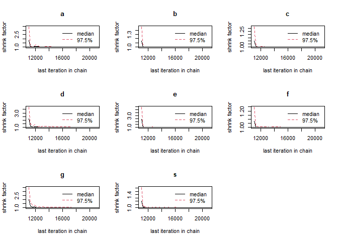
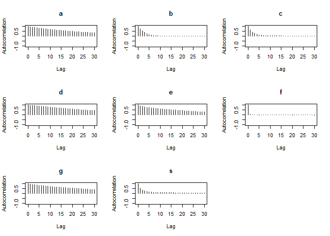
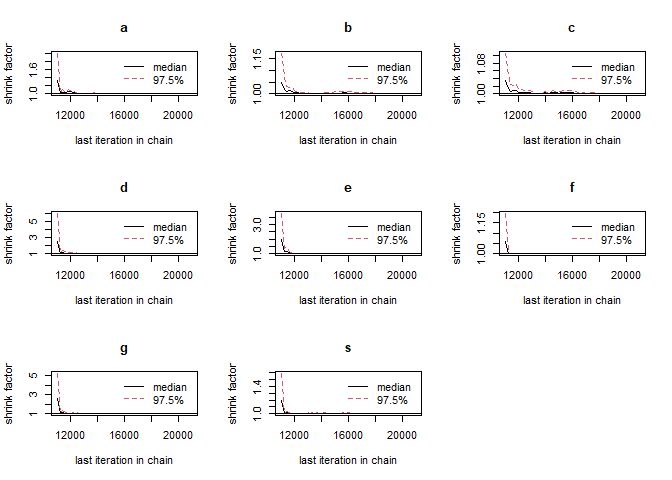

ST417 Bayesian Modelling Project
================
Fionn McGlacken 19388186
2023-01-05

``` r
data <- read.csv("data.csv")

# est short for estimated
new_names <- c(
  "timestamp",
  "est_time",
  "est_distance",
  "est_cost",
  "est_transport",
  "year_group",
  "time",
  "start_time",
  "distance",
  "cost",
  "transport",
  "origin")

colnames(data) <- new_names
```

## Cleaning Data

### Functions for Cleaning Data

``` r
# removes letters from entries
strip_data <- function(column) {
  matcher <- "[^0-9.-]"
  cond <- grepl(matcher, column)
  stripped_rows <- str_remove_all(column[cond], matcher)
  column[cond] <- stripped_rows
  return(column)
}

# removes letters and scales entries by scalar e.g. '80 cents' to '0.8' (euro)
scale_data <- function(column, to_match, scalar) {
  matcher <- paste(to_match, collapse = "|")
  cond <- grepl(matcher, column)
  stripped_rows <- str_remove_all(column[cond], "[^0-9.-]")
  stripped_rows <- as.numeric(stripped_rows)
  column[cond] <- stripped_rows * scalar
  return(column)
}

# replaces range entries by average of range e.g. '7-10' to '8.5'
avg_range <- function(column) {
  matcher <- "^(\\d+)-(\\d+)$"
  cond <- grepl(matcher, column)
  column[cond] <- rowMeans(read.table(text = column[cond],
     sep = "-", header = FALSE), na.rm = TRUE)
  return(column)
}

# replaces range entries by scaled average of range
# e.g. '2-4hrs' to '180' (minutes)
scale_and_avg_range <- function(column, to_match, scalar) {
  matcher <- paste(to_match, collapse = "|")
  cond <- grepl(matcher, column)
  stripped_rows <- str_remove_all(column[cond], to_match)
  table <- read.table(text = stripped_rows, sep = "-", header = FALSE) * scalar
  column[cond] <- rowMeans(table, na.rm = TRUE)
  return(column)
}
```

### Applying Functions to Data

``` r
data <- data %>% mutate(timestamp = as.Date(timestamp))
data <- data %>% mutate(day = weekdays(timestamp))

data$est_time <- sub("to", "-", data$est_time)
data$est_time <- sub("half an hour", "30", data$est_time)
hours <- c("hours", "hrs")
data$est_time <- scale_and_avg_range(data$est_time, hours, 60)
data$est_time <- strip_data(data$est_time)
data$est_time <- avg_range(data$est_time)
data <- data %>% mutate(est_time = as.numeric(est_time))

data$est_distance <- sub("or", "-", data$est_distance)
data$est_distance <- strip_data(data$est_distance)
data$est_distance <- avg_range(data$est_distance)
data <- data %>% mutate(est_distance = as.numeric(est_distance))
```

    ## Warning in mask$eval_all_mutate(quo): NAs introduced by coercion

``` r
data$est_cost <- sub("/", "-", data$est_cost)
cents <- c("cents")
data$est_cost <- scale_data(data$est_cost, cents, 0.01)
data$est_cost <- strip_data(data$est_cost)
data$est_cost <- avg_range(data$est_cost)
data <- data %>% mutate(est_cost = as.numeric(est_cost))

data$time <- strip_data(data$time)
data <- data %>% mutate(time = as.numeric(time))
data$start_time <- as.POSIXct(paste(data$timestamp, data$start_time)
                                    , format = "%Y-%m-%d %H:%M")

# value entered in wrong column
data[52, 9] <- data[52, 10]
data$distance <- sub("Less than a kilometre", "1", data$distance)
data$distance <- strip_data(data$distance)
data <- data %>% mutate(distance = as.numeric(distance))

data[52, 10] <- NA
data[63, 10] <- "0"
zeros <- c("Nothing", "None")
for (i in zeros) {
  data$cost <- sub(i, "0", data$cost)
}
data$cost <- gsub("Less than a kilometre", paste(zeros, collapse = "|")
                  , data$cost)
costs <- c("cent")
data$cost <- scale_data(data$cost, costs, 0.01)
data[3, 10] <- 0.8
data <- data %>% mutate(cost = as.numeric(cost))
```

    ## Warning in mask$eval_all_mutate(quo): NAs introduced by coercion

``` r
# cleaned data
write.csv(data, "cleaned_data.csv")
```

``` r
theta_time <- na.omit(data$est_time)
prior_time <- dnorm(theta_time, mean = mean(theta_time), sd = sd(theta_time))
bayes_df_time <- data.frame(theta_time, prior_time)
bayes_df_time
```

    ##    theta_time   prior_time
    ## 1        30.0 1.329650e-02
    ## 2        15.0 1.066423e-02
    ## 3        30.0 1.329650e-02
    ## 4        15.0 1.066423e-02
    ## 5        15.0 1.066423e-02
    ## 6        20.0 1.181202e-02
    ## 7        30.0 1.329650e-02
    ## 8        35.0 1.351314e-02
    ## 9        30.0 1.329650e-02
    ## 10       40.0 1.334494e-02
    ## 11       20.0 1.181202e-02
    ## 12       30.0 1.329650e-02
    ## 13       15.0 1.066423e-02
    ## 14       20.0 1.181202e-02
    ## 15       40.0 1.334494e-02
    ## 16       20.0 1.181202e-02
    ## 17       40.0 1.334494e-02
    ## 18       30.0 1.329650e-02
    ## 19       15.0 1.066423e-02
    ## 20       15.0 1.066423e-02
    ## 21       20.0 1.181202e-02
    ## 22       30.0 1.329650e-02
    ## 23       20.0 1.181202e-02
    ## 24       20.0 1.181202e-02
    ## 25       15.0 1.066423e-02
    ## 26       40.0 1.334494e-02
    ## 27       15.0 1.066423e-02
    ## 28       25.0 1.271335e-02
    ## 29       30.0 1.329650e-02
    ## 30       20.0 1.181202e-02
    ## 31       37.5 1.347702e-02
    ## 32       30.0 1.329650e-02
    ## 33       20.0 1.181202e-02
    ## 34       30.0 1.329650e-02
    ## 35       20.0 1.181202e-02
    ## 36       60.0 9.527364e-03
    ## 37       30.0 1.329650e-02
    ## 38       15.0 1.066423e-02
    ## 39       10.0 9.355705e-03
    ## 40       20.0 1.181202e-02
    ## 41       40.0 1.334494e-02
    ## 42       60.0 9.527364e-03
    ## 43       60.0 9.527364e-03
    ## 44       30.0 1.329650e-02
    ## 45       49.0 1.213751e-02
    ## 46       50.0 1.194158e-02
    ## 47       20.0 1.181202e-02
    ## 48       90.0 2.430531e-03
    ## 49        8.5 8.945224e-03
    ## 50       17.5 1.126378e-02
    ## 51       25.0 1.271335e-02
    ## 52       25.0 1.271335e-02
    ## 53       45.0 1.280615e-02
    ## 54       60.0 9.527364e-03
    ## 55      180.0 8.219475e-08
    ## 56       30.0 1.329650e-02
    ## 57       30.0 1.329650e-02
    ## 58       20.0 1.181202e-02
    ## 59       30.0 1.329650e-02
    ## 60       20.0 1.181202e-02
    ## 61       25.0 1.271335e-02
    ## 62      180.0 8.219475e-08
    ## 63       30.0 1.329650e-02
    ## 64       45.0 1.280615e-02
    ## 65       45.0 1.280615e-02
    ## 66       75.0 5.475204e-03
    ## 67       20.0 1.181202e-02
    ## 68       60.0 9.527364e-03
    ## 69       45.0 1.280615e-02
    ## 70       60.0 9.527364e-03
    ## 71       20.0 1.181202e-02

``` r
prob_plot(bayes_df_time)
```

<!-- -->

``` r
xbar_time <- mean(data$time, na.rm = TRUE)
n_time <- NROW(data$time)
sigma_time <- sd(data$time, na.rm = TRUE)
se_time <- sigma_time / sqrt(n_time)

# likelihood calculation
likelihood_time <- dnorm(xbar_time, mean = theta_time, sd = se_time)
bayes_df_time <- data.frame(theta_time, prior_time, likelihood_time)

# posterior calculation
bayes_df_time$Product <- bayes_df_time$prior_time * bayes_df_time$likelihood_time # nolint
bayes_df_time$Posterior <- bayes_df_time$Product / sum(bayes_df_time$Product)
bayes_df_time
```

    ##    theta_time   prior_time likelihood_time       Product     Posterior
    ## 1        30.0 1.329650e-02    3.111704e-02  4.137478e-04  2.167277e-02
    ## 2        15.0 1.066423e-02    2.286116e-04  2.437967e-06  1.277046e-04
    ## 3        30.0 1.329650e-02    3.111704e-02  4.137478e-04  2.167277e-02
    ## 4        15.0 1.066423e-02    2.286116e-04  2.437967e-06  1.277046e-04
    ## 5        15.0 1.066423e-02    2.286116e-04  2.437967e-06  1.277046e-04
    ## 6        20.0 1.181202e-02    2.752618e-02  3.251396e-04  1.703133e-02
    ## 7        30.0 1.329650e-02    3.111704e-02  4.137478e-04  2.167277e-02
    ## 8        35.0 1.351314e-02    2.921481e-04  3.947838e-06  2.067941e-04
    ## 9        30.0 1.329650e-02    3.111704e-02  4.137478e-04  2.167277e-02
    ## 10       40.0 1.334494e-02    1.171818e-07  1.563784e-09  8.191353e-08
    ## 11       20.0 1.181202e-02    2.752618e-02  3.251396e-04  1.703133e-02
    ## 12       30.0 1.329650e-02    3.111704e-02  4.137478e-04  2.167277e-02
    ## 13       15.0 1.066423e-02    2.286116e-04  2.437967e-06  1.277046e-04
    ## 14       20.0 1.181202e-02    2.752618e-02  3.251396e-04  1.703133e-02
    ## 15       40.0 1.334494e-02    1.171818e-07  1.563784e-09  8.191353e-08
    ## 16       20.0 1.181202e-02    2.752618e-02  3.251396e-04  1.703133e-02
    ## 17       40.0 1.334494e-02    1.171818e-07  1.563784e-09  8.191353e-08
    ## 18       30.0 1.329650e-02    3.111704e-02  4.137478e-04  2.167277e-02
    ## 19       15.0 1.066423e-02    2.286116e-04  2.437967e-06  1.277046e-04
    ## 20       15.0 1.066423e-02    2.286116e-04  2.437967e-06  1.277046e-04
    ## 21       20.0 1.181202e-02    2.752618e-02  3.251396e-04  1.703133e-02
    ## 22       30.0 1.329650e-02    3.111704e-02  4.137478e-04  2.167277e-02
    ## 23       20.0 1.181202e-02    2.752618e-02  3.251396e-04  1.703133e-02
    ## 24       20.0 1.181202e-02    2.752618e-02  3.251396e-04  1.703133e-02
    ## 25       15.0 1.066423e-02    2.286116e-04  2.437967e-06  1.277046e-04
    ## 26       40.0 1.334494e-02    1.171818e-07  1.563784e-09  8.191353e-08
    ## 27       15.0 1.066423e-02    2.286116e-04  2.437967e-06  1.277046e-04
    ## 28       25.0 1.271335e-02    1.415943e-01  1.800138e-03  9.429412e-02
    ## 29       30.0 1.329650e-02    3.111704e-02  4.137478e-04  2.167277e-02
    ## 30       20.0 1.181202e-02    2.752618e-02  3.251396e-04  1.703133e-02
    ## 31       37.5 1.347702e-02    8.677610e-06  1.169483e-07  6.125939e-06
    ## 32       30.0 1.329650e-02    3.111704e-02  4.137478e-04  2.167277e-02
    ## 33       20.0 1.181202e-02    2.752618e-02  3.251396e-04  1.703133e-02
    ## 34       30.0 1.329650e-02    3.111704e-02  4.137478e-04  2.167277e-02
    ## 35       20.0 1.181202e-02    2.752618e-02  3.251396e-04  1.703133e-02
    ## 36       60.0 9.527364e-03    6.143457e-35  5.853096e-37  3.065945e-35
    ## 37       30.0 1.329650e-02    3.111704e-02  4.137478e-04  2.167277e-02
    ## 38       15.0 1.066423e-02    2.286116e-04  2.437967e-06  1.277046e-04
    ## 39       10.0 9.355705e-03    8.111535e-08  7.588913e-10  3.975194e-08
    ## 40       20.0 1.181202e-02    2.752618e-02  3.251396e-04  1.703133e-02
    ## 41       40.0 1.334494e-02    1.171818e-07  1.563784e-09  8.191353e-08
    ## 42       60.0 9.527364e-03    6.143457e-35  5.853096e-37  3.065945e-35
    ## 43       60.0 9.527364e-03    6.143457e-35  5.853096e-37  3.065945e-35
    ## 44       30.0 1.329650e-02    3.111704e-02  4.137478e-04  2.167277e-02
    ## 45       49.0 1.213751e-02    3.191297e-17  3.873441e-19  2.028971e-17
    ## 46       50.0 1.194158e-02    1.470049e-18  1.755470e-20  9.195436e-19
    ## 47       20.0 1.181202e-02    2.752618e-02  3.251396e-04  1.703133e-02
    ## 48       90.0 2.430531e-03   6.127925e-117 1.489411e-119 7.801774e-118
    ## 49        8.5 8.945224e-03    4.046520e-09  3.619703e-11  1.896058e-09
    ## 50       17.5 1.126378e-02    3.720408e-03  4.190585e-05  2.195095e-03
    ## 51       25.0 1.271335e-02    1.415943e-01  1.800138e-03  9.429412e-02
    ## 52       25.0 1.271335e-02    1.415943e-01  1.800138e-03  9.429412e-02
    ## 53       45.0 1.280615e-02    2.008028e-12  2.571510e-14  1.346998e-12
    ## 54       60.0 9.527364e-03    6.143457e-35  5.853096e-37  3.065945e-35
    ## 55      180.0 8.219475e-08    0.000000e+00  0.000000e+00  0.000000e+00
    ## 56       30.0 1.329650e-02    3.111704e-02  4.137478e-04  2.167277e-02
    ## 57       30.0 1.329650e-02    3.111704e-02  4.137478e-04  2.167277e-02
    ## 58       20.0 1.181202e-02    2.752618e-02  3.251396e-04  1.703133e-02
    ## 59       30.0 1.329650e-02    3.111704e-02  4.137478e-04  2.167277e-02
    ## 60       20.0 1.181202e-02    2.752618e-02  3.251396e-04  1.703133e-02
    ## 61       25.0 1.271335e-02    1.415943e-01  1.800138e-03  9.429412e-02
    ## 62      180.0 8.219475e-08    0.000000e+00  0.000000e+00  0.000000e+00
    ## 63       30.0 1.329650e-02    3.111704e-02  4.137478e-04  2.167277e-02
    ## 64       45.0 1.280615e-02    2.008028e-12  2.571510e-14  1.346998e-12
    ## 65       45.0 1.280615e-02    2.008028e-12  2.571510e-14  1.346998e-12
    ## 66       75.0 5.475204e-03    8.911020e-70  4.878965e-72  2.555680e-70
    ## 67       20.0 1.181202e-02    2.752618e-02  3.251396e-04  1.703133e-02
    ## 68       60.0 9.527364e-03    6.143457e-35  5.853096e-37  3.065945e-35
    ## 69       45.0 1.280615e-02    2.008028e-12  2.571510e-14  1.346998e-12
    ## 70       60.0 9.527364e-03    6.143457e-35  5.853096e-37  3.065945e-35
    ## 71       20.0 1.181202e-02    2.752618e-02  3.251396e-04  1.703133e-02

``` r
# prior and posterior comparison
prior_post_plot(bayes_df_time)
```

<!-- -->

``` r
theta_dist <- na.omit(data$est_distance)
prior_dist <- dnorm(theta_dist, mean = mean(theta_dist), sd = sd(theta_dist))
bayes_df_dist <- data.frame(theta_dist, prior_dist)
bayes_df_dist
```

    ##    theta_dist   prior_dist
    ## 1         3.0 1.806677e-02
    ## 2        20.0 2.155656e-02
    ## 3        10.0 2.172206e-02
    ## 4        10.0 2.172206e-02
    ## 5         3.0 1.806677e-02
    ## 6        10.0 2.172206e-02
    ## 7         4.0 1.872681e-02
    ## 8         3.5 1.840116e-02
    ## 9         2.5 1.772433e-02
    ## 10       15.0 2.251851e-02
    ## 11       15.0 2.251851e-02
    ## 12       15.0 2.251851e-02
    ## 13        3.0 1.806677e-02
    ## 14        5.0 1.934921e-02
    ## 15        5.0 1.934921e-02
    ## 16        5.0 1.934921e-02
    ## 17       10.0 2.172206e-02
    ## 18        4.0 1.872681e-02
    ## 19        4.0 1.872681e-02
    ## 20        3.5 1.840116e-02
    ## 21       18.0 2.214702e-02
    ## 22        2.0 1.737453e-02
    ## 23        1.0 1.665566e-02
    ## 24        3.0 1.806677e-02
    ## 25       40.0 8.161101e-03
    ## 26        2.0 1.737453e-02
    ## 27       10.0 2.172206e-02
    ## 28       10.0 2.172206e-02
    ## 29        1.5 1.701807e-02
    ## 30        5.0 1.934921e-02
    ## 31       25.0 1.905549e-02
    ## 32        5.0 1.934921e-02
    ## 33       25.0 1.905549e-02
    ## 34        2.0 1.737453e-02
    ## 35       20.0 2.155656e-02
    ## 36        3.0 1.806677e-02
    ## 37        7.0 2.046021e-02
    ## 38       80.0 2.554681e-05
    ## 39       10.0 2.172206e-02
    ## 40       10.0 2.172206e-02
    ## 41       20.0 2.155656e-02
    ## 42       75.0 6.942001e-05
    ## 43        5.0 1.934921e-02
    ## 44        5.0 1.934921e-02
    ## 45       15.0 2.251851e-02
    ## 46        3.0 1.806677e-02
    ## 47       40.0 8.161101e-03
    ## 48        7.0 2.046021e-02
    ## 49        7.0 2.046021e-02
    ## 50        2.0 1.737453e-02
    ## 51       10.0 2.172206e-02
    ## 52       35.0 1.172478e-02
    ## 53       45.0 5.245582e-03
    ## 54       70.0 1.741942e-04
    ## 55        5.0 1.934921e-02
    ## 56        5.0 1.934921e-02
    ## 57        8.0 2.093909e-02
    ## 58        7.0 2.046021e-02
    ## 59        2.0 1.737453e-02
    ## 60       10.0 2.172206e-02
    ## 61       60.0 8.636435e-04
    ## 62       20.0 2.155656e-02
    ## 63       20.0 2.155656e-02
    ## 64        4.2 1.885447e-02
    ## 65       45.0 5.245582e-03
    ## 66        2.0 1.737453e-02
    ## 67       30.0 1.555471e-02
    ## 68       21.0 2.116584e-02
    ## 69       20.0 2.155656e-02
    ## 70        5.0 1.934921e-02

``` r
prob_plot(bayes_df_dist)
```

<!-- -->

``` r
xbar_dist <- mean(data$distance, na.rm = TRUE)
n_dist <- NROW(data$distance)
sigma_dist <- sd(data$distance, na.rm = TRUE)
se_dist <- sigma_dist / sqrt(n_dist)

# likelihood calculation
likelihood_dist <- dnorm(xbar_dist, mean = theta_dist, sd = se_dist)
bayes_df_dist <- data.frame(theta_dist, prior_dist, likelihood_dist)

# posterior calculation
bayes_df_dist$Product <- bayes_df_dist$prior_dist * bayes_df_dist$likelihood_dist # nolint
bayes_df_dist$Posterior <- bayes_df_dist$Product / sum(bayes_df_dist$Product)
bayes_df_dist
```

    ##    theta_dist   prior_dist likelihood_dist       Product     Posterior
    ## 1         3.0 1.806677e-02    2.082309e-03  3.762060e-05  6.488084e-04
    ## 2        20.0 2.155656e-02    1.051059e-07  2.265722e-09  3.907486e-08
    ## 3        10.0 2.172206e-02    1.788449e-01  3.884879e-03  6.699899e-02
    ## 4        10.0 2.172206e-02    1.788449e-01  3.884879e-03  6.699899e-02
    ## 5         3.0 1.806677e-02    2.082309e-03  3.762060e-05  6.488084e-04
    ## 6        10.0 2.172206e-02    1.788449e-01  3.884879e-03  6.699899e-02
    ## 7         4.0 1.872681e-02    8.170387e-03  1.530053e-04  2.638744e-03
    ## 8         3.5 1.840116e-02    4.252260e-03  7.824650e-05  1.349447e-03
    ## 9         2.5 1.772433e-02    9.594424e-04  1.700547e-05  2.932780e-04
    ## 10       15.0 2.251851e-02    2.881651e-03  6.489048e-05  1.119107e-03
    ## 11       15.0 2.251851e-02    2.881651e-03  6.489048e-05  1.119107e-03
    ## 12       15.0 2.251851e-02    2.881651e-03  6.489048e-05  1.119107e-03
    ## 13        3.0 1.806677e-02    2.082309e-03  3.762060e-05  6.488084e-04
    ## 14        5.0 1.934921e-02    2.512655e-02  4.861788e-04  8.384686e-03
    ## 15        5.0 1.934921e-02    2.512655e-02  4.861788e-04  8.384686e-03
    ## 16        5.0 1.934921e-02    2.512655e-02  4.861788e-04  8.384686e-03
    ## 17       10.0 2.172206e-02    1.788449e-01  3.884879e-03  6.699899e-02
    ## 18        4.0 1.872681e-02    8.170387e-03  1.530053e-04  2.638744e-03
    ## 19        4.0 1.872681e-02    8.170387e-03  1.530053e-04  2.638744e-03
    ## 20        3.5 1.840116e-02    4.252260e-03  7.824650e-05  1.349447e-03
    ## 21       18.0 2.214702e-02    1.300931e-05  2.881176e-07  4.968903e-06
    ## 22        2.0 1.737453e-02    4.159497e-04  7.226930e-06  1.246363e-04
    ## 23        1.0 1.665566e-02    6.512220e-05  1.084653e-06  1.870603e-05
    ## 24        3.0 1.806677e-02    2.082309e-03  3.762060e-05  6.488084e-04
    ## 25       40.0 8.161101e-03    6.573280e-52  5.364520e-54  9.251703e-53
    ## 26        2.0 1.737453e-02    4.159497e-04  7.226930e-06  1.246363e-04
    ## 27       10.0 2.172206e-02    1.788449e-01  3.884879e-03  6.699899e-02
    ## 28       10.0 2.172206e-02    1.788449e-01  3.884879e-03  6.699899e-02
    ## 29        1.5 1.701807e-02    1.696723e-04  2.887495e-06  4.979801e-05
    ## 30        5.0 1.934921e-02    2.512655e-02  4.861788e-04  8.384686e-03
    ## 31       25.0 1.905549e-02    8.678293e-15  1.653692e-16  2.851972e-15
    ## 32        5.0 1.934921e-02    2.512655e-02  4.861788e-04  8.384686e-03
    ## 33       25.0 1.905549e-02    8.678293e-15  1.653692e-16  2.851972e-15
    ## 34        2.0 1.737453e-02    4.159497e-04  7.226930e-06  1.246363e-04
    ## 35       20.0 2.155656e-02    1.051059e-07  2.265722e-09  3.907486e-08
    ## 36        3.0 1.806677e-02    2.082309e-03  3.762060e-05  6.488084e-04
    ## 37        7.0 2.046021e-02    1.144173e-01  2.341003e-03  4.037316e-02
    ## 38       80.0 2.554681e-05   2.763793e-267 7.060610e-272 1.217679e-270
    ## 39       10.0 2.172206e-02    1.788449e-01  3.884879e-03  6.699899e-02
    ## 40       10.0 2.172206e-02    1.788449e-01  3.884879e-03  6.699899e-02
    ## 41       20.0 2.155656e-02    1.051059e-07  2.265722e-09  3.907486e-08
    ## 42       75.0 6.942001e-05   4.184718e-231 2.905031e-235 5.010044e-234
    ## 43        5.0 1.934921e-02    2.512655e-02  4.861788e-04  8.384686e-03
    ## 44        5.0 1.934921e-02    2.512655e-02  4.861788e-04  8.384686e-03
    ## 45       15.0 2.251851e-02    2.881651e-03  6.489048e-05  1.119107e-03
    ## 46        3.0 1.806677e-02    2.082309e-03  3.762060e-05  6.488084e-04
    ## 47       40.0 8.161101e-03    6.573280e-52  5.364520e-54  9.251703e-53
    ## 48        7.0 2.046021e-02    1.144173e-01  2.341003e-03  4.037316e-02
    ## 49        7.0 2.046021e-02    1.144173e-01  2.341003e-03  4.037316e-02
    ## 50        2.0 1.737453e-02    4.159497e-04  7.226930e-06  1.246363e-04
    ## 51       10.0 2.172206e-02    1.788449e-01  3.884879e-03  6.699899e-02
    ## 52       35.0 1.172478e-02    6.862965e-37  8.046678e-39  1.387738e-37
    ## 53       45.0 5.245582e-03    1.425193e-69  7.475966e-72  1.289312e-70
    ## 54       70.0 1.741942e-04   1.434326e-197 2.498512e-201 4.308958e-200
    ## 55        5.0 1.934921e-02    2.512655e-02  4.861788e-04  8.384686e-03
    ## 56        5.0 1.934921e-02    2.512655e-02  4.861788e-04  8.384686e-03
    ## 57        8.0 2.093909e-02    1.694184e-01  3.547466e-03  6.117994e-02
    ## 58        7.0 2.046021e-02    1.144173e-01  2.341003e-03  4.037316e-02
    ## 59        2.0 1.737453e-02    4.159497e-04  7.226930e-06  1.246363e-04
    ## 60       10.0 2.172206e-02    1.788449e-01  3.884879e-03  6.699899e-02
    ## 61       60.0 8.636435e-04   1.954676e-138 1.688144e-141 2.911389e-140
    ## 62       20.0 2.155656e-02    1.051059e-07  2.265722e-09  3.907486e-08
    ## 63       20.0 2.155656e-02    1.051059e-07  2.265722e-09  3.907486e-08
    ## 64        4.2 1.885447e-02    1.043002e-02  1.966526e-04  3.391489e-03
    ## 65       45.0 5.245582e-03    1.425193e-69  7.475966e-72  1.289312e-70
    ## 66        2.0 1.737453e-02    4.159497e-04  7.226930e-06  1.246363e-04
    ## 67       30.0 1.555471e-02    1.622043e-24  2.523042e-26  4.351263e-25
    ## 68       21.0 2.116584e-02    6.555457e-09  1.387518e-10  2.392926e-09
    ## 69       20.0 2.155656e-02    1.051059e-07  2.265722e-09  3.907486e-08
    ## 70        5.0 1.934921e-02    2.512655e-02  4.861788e-04  8.384686e-03

``` r
# prior and posterior comparison
prior_post_plot(bayes_df_dist)
```

<!-- -->

``` r
theta_cost <- na.omit(data$est_cost)
prior_cost <- dnorm(theta_cost, mean = mean(theta_cost), sd = sd(theta_cost))
bayes_df_cost <- data.frame(theta_cost, prior_cost)
bayes_df_cost
```

    ##    theta_cost   prior_cost
    ## 1         3.0 7.718878e-02
    ## 2         5.0 9.683788e-02
    ## 3         0.8 4.526016e-02
    ## 4         3.0 7.718878e-02
    ## 5         1.5 5.540087e-02
    ## 6         6.0 9.889950e-02
    ## 7         2.0 6.283649e-02
    ## 8         5.0 9.683788e-02
    ## 9         3.0 7.718878e-02
    ## 10        6.0 9.889950e-02
    ## 11        4.0 8.915902e-02
    ## 12        5.0 9.683788e-02
    ## 13        2.0 6.283649e-02
    ## 14        6.0 9.889950e-02
    ## 15        5.0 9.683788e-02
    ## 16        5.0 9.683788e-02
    ## 17        5.0 9.683788e-02
    ## 18        2.0 6.283649e-02
    ## 19        5.0 9.683788e-02
    ## 20        3.0 7.718878e-02
    ## 21       10.0 5.814039e-02
    ## 22        4.5 9.363682e-02
    ## 23        2.5 7.018179e-02
    ## 24        0.0 3.462055e-02
    ## 25        2.0 6.283649e-02
    ## 26        7.0 9.497554e-02
    ## 27        5.0 9.683788e-02
    ## 28        5.0 9.683788e-02
    ## 29        7.0 9.497554e-02
    ## 30        1.0 4.809927e-02
    ## 31       10.0 5.814039e-02
    ## 32        5.0 9.683788e-02
    ## 33        3.0 7.718878e-02
    ## 34       15.0 7.492592e-03
    ## 35        3.0 7.718878e-02
    ## 36       10.0 5.814039e-02
    ## 37        5.0 9.683788e-02
    ## 38        5.0 9.683788e-02
    ## 39       25.0 1.230565e-06
    ## 40        5.0 9.683788e-02
    ## 41        5.0 9.683788e-02
    ## 42       10.0 5.814039e-02
    ## 43       12.5 2.529821e-02
    ## 44        5.0 9.683788e-02
    ## 45        4.0 8.915902e-02
    ## 46        4.0 8.915902e-02
    ## 47        6.0 9.889950e-02
    ## 48       10.0 5.814039e-02
    ## 49        6.0 9.889950e-02
    ## 50        5.0 9.683788e-02
    ## 51        5.0 9.683788e-02
    ## 52        5.0 9.683788e-02
    ## 53       10.0 5.814039e-02
    ## 54       10.0 5.814039e-02
    ## 55       12.0 3.081293e-02
    ## 56        3.0 7.718878e-02
    ## 57        5.0 9.683788e-02
    ## 58        2.0 6.283649e-02
    ## 59        5.0 9.683788e-02
    ## 60        1.0 4.809927e-02
    ## 61       10.0 5.814039e-02
    ## 62       15.0 7.492592e-03
    ## 63        2.0 6.283649e-02
    ## 64       10.0 5.814039e-02
    ## 65        6.0 9.889950e-02
    ## 66        2.0 6.283649e-02
    ## 67       10.0 5.814039e-02
    ## 68        6.0 9.889950e-02
    ## 69        7.0 9.497554e-02
    ## 70        4.0 8.915902e-02
    ## 71       10.0 5.814039e-02

``` r
prob_plot(bayes_df_cost)
```

<!-- -->

``` r
xbar_cost <- mean(data$cost, na.rm = TRUE)
n_cost <- NROW(data$cost)
sigma_cost <- sd(data$cost, na.rm = TRUE)
se_cost <- sigma_cost / sqrt(n_cost)

# likelihood calculation
likelihood_cost <- dnorm(xbar_cost, mean = theta_cost, sd = se_cost)
bayes_df_cost <- data.frame(theta_cost, prior_cost, likelihood_cost)

# posterior calculation
bayes_df_cost$Product <- bayes_df_cost$prior_cost * bayes_df_cost$likelihood_cost # nolint
bayes_df_cost$Posterior <- bayes_df_cost$Product / sum(bayes_df_cost$Product)
bayes_df_cost
```

    ##    theta_cost   prior_cost likelihood_cost       Product     Posterior
    ## 1         3.0 7.718878e-02    4.916232e-03  3.794780e-04  9.593465e-04
    ## 2         5.0 9.683788e-02    5.104159e-15  4.942759e-16  1.249564e-15
    ## 3         0.8 4.526016e-02    1.083789e-01  4.905248e-03  1.240080e-02
    ## 4         3.0 7.718878e-02    4.916232e-03  3.794780e-04  9.593465e-04
    ## 5         1.5 5.540087e-02    8.971016e-01  4.970021e-02  1.256456e-01
    ## 6         6.0 9.889950e-02    7.452719e-25  7.370701e-26  1.863364e-25
    ## 7         2.0 6.283649e-02    6.914028e-01  4.344532e-02  1.098328e-01
    ## 8         5.0 9.683788e-02    5.104159e-15  4.942759e-16  1.249564e-15
    ## 9         3.0 7.718878e-02    4.916232e-03  3.794780e-04  9.593465e-04
    ## 10        6.0 9.889950e-02    7.452719e-25  7.370701e-26  1.863364e-25
    ## 11        4.0 8.915902e-02    9.572604e-08  8.534840e-09  2.157666e-08
    ## 12        5.0 9.683788e-02    5.104159e-15  4.942759e-16  1.249564e-15
    ## 13        2.0 6.283649e-02    6.914028e-01  4.344532e-02  1.098328e-01
    ## 14        6.0 9.889950e-02    7.452719e-25  7.370701e-26  1.863364e-25
    ## 15        5.0 9.683788e-02    5.104159e-15  4.942759e-16  1.249564e-15
    ## 16        5.0 9.683788e-02    5.104159e-15  4.942759e-16  1.249564e-15
    ## 17        5.0 9.683788e-02    5.104159e-15  4.942759e-16  1.249564e-15
    ## 18        2.0 6.283649e-02    6.914028e-01  4.344532e-02  1.098328e-01
    ## 19        5.0 9.683788e-02    5.104159e-15  4.942759e-16  1.249564e-15
    ## 20        3.0 7.718878e-02    4.916232e-03  3.794780e-04  9.593465e-04
    ## 21       10.0 5.814039e-02    8.032317e-90  4.670021e-91  1.180613e-90
    ## 22        4.5 9.363682e-02    4.621576e-11  4.327497e-12  1.094021e-11
    ## 23        2.5 7.018179e-02    1.218975e-01  8.554983e-03  2.162759e-02
    ## 24        0.0 3.462055e-02    2.808134e-04  9.721913e-06  2.457767e-05
    ## 25        2.0 6.283649e-02    6.914028e-01  4.344532e-02  1.098328e-01
    ## 26        7.0 9.497554e-02    2.979900e-37  2.830176e-38  7.154880e-38
    ## 27        5.0 9.683788e-02    5.104159e-15  4.942759e-16  1.249564e-15
    ## 28        5.0 9.683788e-02    5.104159e-15  4.942759e-16  1.249564e-15
    ## 29        7.0 9.497554e-02    2.979900e-37  2.830176e-38  7.154880e-38
    ## 30        1.0 4.809927e-02    2.662725e-01  1.280751e-02  3.237827e-02
    ## 31       10.0 5.814039e-02    8.032317e-90  4.670021e-91  1.180613e-90
    ## 32        5.0 9.683788e-02    5.104159e-15  4.942759e-16  1.249564e-15
    ## 33        3.0 7.718878e-02    4.916232e-03  3.794780e-04  9.593465e-04
    ## 34       15.0 7.492592e-03   1.094379e-228 8.199736e-231 2.072950e-230
    ## 35        3.0 7.718878e-02    4.916232e-03  3.794780e-04  9.593465e-04
    ## 36       10.0 5.814039e-02    8.032317e-90  4.670021e-91  1.180613e-90
    ## 37        5.0 9.683788e-02    5.104159e-15  4.942759e-16  1.249564e-15
    ## 38        5.0 9.683788e-02    5.104159e-15  4.942759e-16  1.249564e-15
    ## 39       25.0 1.230565e-06    0.000000e+00  0.000000e+00  0.000000e+00
    ## 40        5.0 9.683788e-02    5.104159e-15  4.942759e-16  1.249564e-15
    ## 41        5.0 9.683788e-02    5.104159e-15  4.942759e-16  1.249564e-15
    ## 42       10.0 5.814039e-02    8.032317e-90  4.670021e-91  1.180613e-90
    ## 43       12.5 2.529821e-02   3.018756e-151 7.636914e-153 1.930664e-152
    ## 44        5.0 9.683788e-02    5.104159e-15  4.942759e-16  1.249564e-15
    ## 45        4.0 8.915902e-02    9.572604e-08  8.534840e-09  2.157666e-08
    ## 46        4.0 8.915902e-02    9.572604e-08  8.534840e-09  2.157666e-08
    ## 47        6.0 9.889950e-02    7.452719e-25  7.370701e-26  1.863364e-25
    ## 48       10.0 5.814039e-02    8.032317e-90  4.670021e-91  1.180613e-90
    ## 49        6.0 9.889950e-02    7.452719e-25  7.370701e-26  1.863364e-25
    ## 50        5.0 9.683788e-02    5.104159e-15  4.942759e-16  1.249564e-15
    ## 51        5.0 9.683788e-02    5.104159e-15  4.942759e-16  1.249564e-15
    ## 52        5.0 9.683788e-02    5.104159e-15  4.942759e-16  1.249564e-15
    ## 53       10.0 5.814039e-02    8.032317e-90  4.670021e-91  1.180613e-90
    ## 54       10.0 5.814039e-02    8.032317e-90  4.670021e-91  1.180613e-90
    ## 55       12.0 3.081293e-02   1.111943e-137 3.426222e-139 8.661724e-139
    ## 56        3.0 7.718878e-02    4.916232e-03  3.794780e-04  9.593465e-04
    ## 57        5.0 9.683788e-02    5.104159e-15  4.942759e-16  1.249564e-15
    ## 58        2.0 6.283649e-02    6.914028e-01  4.344532e-02  1.098328e-01
    ## 59        5.0 9.683788e-02    5.104159e-15  4.942759e-16  1.249564e-15
    ## 60        1.0 4.809927e-02    2.662725e-01  1.280751e-02  3.237827e-02
    ## 61       10.0 5.814039e-02    8.032317e-90  4.670021e-91  1.180613e-90
    ## 62       15.0 7.492592e-03   1.094379e-228 8.199736e-231 2.072950e-230
    ## 63        2.0 6.283649e-02    6.914028e-01  4.344532e-02  1.098328e-01
    ## 64       10.0 5.814039e-02    8.032317e-90  4.670021e-91  1.180613e-90
    ## 65        6.0 9.889950e-02    7.452719e-25  7.370701e-26  1.863364e-25
    ## 66        2.0 6.283649e-02    6.914028e-01  4.344532e-02  1.098328e-01
    ## 67       10.0 5.814039e-02    8.032317e-90  4.670021e-91  1.180613e-90
    ## 68        6.0 9.889950e-02    7.452719e-25  7.370701e-26  1.863364e-25
    ## 69        7.0 9.497554e-02    2.979900e-37  2.830176e-38  7.154880e-38
    ## 70        4.0 8.915902e-02    9.572604e-08  8.534840e-09  2.157666e-08
    ## 71       10.0 5.814039e-02    8.032317e-90  4.670021e-91  1.180613e-90

``` r
# prior and posterior comparison
prior_post_plot(bayes_df_cost)
```

<!-- -->

``` r
m0_time <- mean(data$est_time, na.rm = TRUE)
m0_dist <- mean(data$est_distance, na.rm = TRUE)
m0_cost <- mean(data$est_cost, na.rm = TRUE)
s0_time <- sd(data$est_time, na.rm = TRUE)
s0_dist <- sd(data$est_distance, na.rm = TRUE)
s0_cost <- sd(data$est_cost, na.rm = TRUE)
```

``` r
post_mean_time <- ((1 / (se_time^2) + 1 / (s0_time^2))^(-1)) * (xbar_time / (se_time^2) + m0_time / (s0_time^2)) # nolint
post_sd_time <- sqrt((1 / (se_time^2) + 1 / (s0_time^2))^(-1))

post_mean_dist <- (1 / (se_dist^2) + 1 / (s0_dist^2))^(-1) * (xbar_dist / (se_dist^2) + m0_dist / (s0_dist^2)) # nolint
post_sd_dist <- sqrt((1 / (se_dist^2) + 1 / (s0_dist^2))^(-1))

post_mean_cost <- (1 / (se_cost^2) + 1 / (s0_cost^2))^(-1) * (xbar_cost / (se_cost^2) + m0_cost / (s0_cost^2)) # nolint
post_sd_cost <- sqrt((1 / (se_cost^2) + 1 / (s0_cost^2))^(-1))
```

``` r
# 95% credible intervals
time_sims <- rnorm(10000, mean = post_mean_time, sd = post_sd_time)
time_point_estimate <- mean(time_sims)
time_point_estimate
```

    ## [1] 25.15946

``` r
time_ci95 <- quantile(time_sims, probs = c(0.025, 0.975))
time_ci95
```

    ##     2.5%    97.5% 
    ## 19.68944 30.73285

``` r
normal_interval(0.95, time_ci95)
```

<!-- -->

``` r
dist_sims <- rnorm(10000, mean = post_mean_dist, sd = post_sd_dist)
dist_point_estimate <- mean(dist_sims)
dist_point_estimate
```

    ## [1] 9.154057

``` r
dist_ci95 <- quantile(dist_sims, probs = c(0.025, 0.975))
dist_ci95
```

    ##      2.5%     97.5% 
    ##  5.234244 13.105129

``` r
normal_interval(0.95, dist_ci95)
```

<!-- -->

``` r
cost_sims <- rnorm(10000, mean = post_mean_cost, sd = post_sd_cost)
cost_point_estimate <- mean(cost_sims)
cost_point_estimate
```

    ## [1] 1.703047

``` r
cost_ci95 <- quantile(cost_sims, probs = c(0.025, 0.975))
cost_ci95
```

    ##      2.5%     97.5% 
    ## 0.9078246 2.4871981

``` r
normal_interval(0.95, cost_ci95)
```

<!-- -->

``` r
# # 95% credible intervals plot
# x <- seq(from = 0, to = 100, length.out = 1000)

# priorx_time <- dnorm(x, mean = mean(data$est_time, na.rm = TRUE), sd = sd(data$est_time, na.rm = TRUE)) # nolint
# priorx_dist <- dnorm(x, mean = mean(data$est_distance, na.rm = TRUE), sd = sd(data$est_distance, na.rm = TRUE)) # nolint
# priorx_cost <- dnorm(x, mean = mean(data$est_cost, na.rm = TRUE), sd = sd(data$est_cost, na.rm = TRUE)) # nolint

# datax_time  <- dnorm(x, mean = mean(data$time, na.rm = TRUE), sd = se_time)
# datax_dist  <- dnorm(x, mean = mean(data$distance, na.rm = TRUE), sd = se_dist)
# datax_cost  <- dnorm(x, mean = mean(data$cost, na.rm = TRUE), sd = se_cost)

# postx_time  <- dnorm(x, mean = post_mean_time, sd = post_sd_time)
# postx_dist  <- dnorm(x, mean = post_mean_dist, sd = post_sd_dist)
# postx_cost  <- dnorm(x, mean = post_mean_cost, sd = post_sd_cost)

# plot(x, priorx_time, type = "l", col = "blue", lwd = 2, xlab = "Time (min)", ylab = "Density", main = "Prior and Posterior Distributions") # nolint
# lines(x, datax_time, col = "red", lwd = 2)
# lines(x, postx_time, col = "green", lwd = 2)

# legend("topright", legend = c("Prior", "Data", "Posterior"), col = c("blue", "red", "green"), lwd = 2) # nolint
```

``` r
x <- seq(-60, 80, length = 150)

priorx_time <- dnorm(x, mean = mean(data$est_time, na.rm = TRUE),
                     sd = sd(data$est_time, na.rm = TRUE))
priorx_dist <- dnorm(x, mean = mean(data$est_distance, na.rm = TRUE),
                     sd = sd(data$est_distance, na.rm = TRUE))
priorx_cost <- dnorm(x, mean = mean(data$est_cost, na.rm = TRUE),
                     sd = sd(data$est_cost, na.rm = TRUE))

datax_time  <- dnorm(x, mean = mean(data$time, na.rm = TRUE), sd = se_time)
datax_dist  <- dnorm(x, mean = mean(data$distance, na.rm = TRUE), sd = se_dist)
datax_cost  <- dnorm(x, mean = mean(data$cost, na.rm = TRUE), sd = se_cost)

postx_time <- dnorm(x, mean = post_mean_time, sd = post_sd_time)
postx_dist <- dnorm(x, mean = post_mean_dist, sd = post_sd_dist)
postx_cost <- dnorm(x, mean = post_mean_cost, sd = post_sd_cost)

plot(x, priorx_time, type = "l", lwd = 3, xlim = c(-40, 60), ylim = c(0, 0.8),
     col = "red4", main = "", xlab = "theta", ylab = "")
lines(x, priorx_dist, col = "green4", lwd = 3)
lines(x, priorx_cost, col = "orange3", lwd = 3)

lines(x, datax_time, col = "black", lwd = 3)
lines(x, datax_dist, col = "black", lwd = 3)
lines(x, datax_cost, col = "black", lwd = 3)

lines(x, postx_time, col = "red", lwd = 3)
lines(x, postx_dist, col = "green", lwd = 3)
lines(x, postx_cost, col = "orange", lwd = 3)

legend("topright",
       c("Time Prior", "Distance Prior", "Cost Prior", "Data",
        "Time Post", "Distance Post", "Cost Post"),
       lty = 1, lwd = 3,
       col = c("red4", "green4", "orange3", "black", "red", "green", "orange")
       )
```

<!-- -->

## Bayesian Analysis with rjags

``` r
# define model
model <- "
model {
  for (i in 1:N) {
    time[i] ~ dnorm(mu_time, sigma_time)
    distance[i] ~ dnorm(mu_dist, sigma_dist)
    cost[i] ~ dnorm(mu_cost, sigma_cost)
  }
  mu_time ~ dnorm(m0_time, sigma0_time)
  mu_dist ~ dnorm(m0_dist, sigma0_dist)
  mu_cost ~ dnorm(m0_cost, sigma0_cost)
  sigma_time ~ dgamma(a0_time, b0_time)
  sigma_dist ~ dgamma(a0_dist, b0_dist)
  sigma_cost ~ dgamma(a0_cost, b0_cost)
}
"
```

``` r
# data
data <- list(
  N = nrow(data),
  time = data$time,
  distance = data$distance,
  cost = data$cost,
  m0_time = m0_time,
  m0_dist = m0_dist,
  m0_cost = m0_cost,
  sigma0_time = 1 / (s0_time^2),
  sigma0_dist = 1 / (s0_dist^2),
  sigma0_cost = 1 / (s0_cost^2),
  a0_time = 1 / (se_time^2),
  a0_dist = 1 / (se_dist^2),
  a0_cost = 1 / (se_cost^2),
  b0_time = 1 / (se_time^2) * xbar_time,
  b0_dist = 1 / (se_dist^2) * xbar_dist,
  b0_cost = 1 / (se_cost^2) * xbar_cost
)
```

``` r
# compile model
jags_model <- jags.model(
  textConnection(model),
  data = data,
  inits = list(.RNG.name = "base::Wichmann-Hill", .RNG.seed = 1989)
)
```

    ## Compiling model graph
    ##    Resolving undeclared variables
    ##    Allocating nodes
    ## Graph information:
    ##    Observed stochastic nodes: 207
    ##    Unobserved stochastic nodes: 15
    ##    Total graph size: 235
    ## 
    ## Initializing model

``` r
# burn in model
update(jags_model, 1000)
```

``` r
# simulate posterior
sims <- coda.samples(
  jags_model,
  variable.names = c("mu_time", "mu_dist", "mu_cost",
                     "sigma_time", "sigma_dist", "sigma_cost"),
  n.iter = 10000
)
```

``` r
# plot sims
plot(sims)
```

<!-- --><!-- -->

``` r
# summary
summary(sims)
```

    ## 
    ## Iterations = 1001:11000
    ## Thinning interval = 1 
    ## Number of chains = 1 
    ## Sample size per chain = 10000 
    ## 
    ## 1. Empirical mean and standard deviation for each variable,
    ##    plus standard error of the mean:
    ## 
    ##                 Mean        SD  Naive SE Time-series SE
    ## mu_cost     1.711712 0.4108362 4.108e-03      4.108e-03
    ## mu_dist     9.177441 2.0488922 2.049e-02      2.049e-02
    ## mu_time    25.222705 2.8560561 2.856e-02      2.949e-02
    ## sigma_cost  0.094969 0.0153308 1.533e-04      1.554e-04
    ## sigma_dist  0.003397 0.0005688 5.688e-06      5.771e-06
    ## sigma_time  0.001763 0.0002961 2.961e-06      3.039e-06
    ## 
    ## 2. Quantiles for each variable:
    ## 
    ##                 2.5%       25%       50%       75%     97.5%
    ## mu_cost     0.905480  1.432644  1.715283  1.989193  2.513230
    ## mu_dist     5.111418  7.793923  9.174260 10.530034 13.236099
    ## mu_time    19.595055 23.313983 25.193080 27.133262 30.866511
    ## sigma_cost  0.067490  0.084089  0.094029  0.104970  0.126945
    ## sigma_dist  0.002380  0.003005  0.003368  0.003753  0.004620
    ## sigma_time  0.001227  0.001556  0.001748  0.001952  0.002377

``` r
# compile model
jags_model_mc <- jags.model(
  textConnection(model),
  data = data,
  n.chains = 3
)
```

    ## Compiling model graph
    ##    Resolving undeclared variables
    ##    Allocating nodes
    ## Graph information:
    ##    Observed stochastic nodes: 207
    ##    Unobserved stochastic nodes: 15
    ##    Total graph size: 235
    ## 
    ## Initializing model

``` r
# burn in model
update(jags_model_mc, 1000)
```

``` r
# simulate posterior
sims_mc <- coda.samples(
  jags_model_mc,
  variable.names = c("mu_time", "mu_dist", "mu_cost",
                     "sigma_time", "sigma_dist", "sigma_cost"),
  n.iter = 10000
)
```

``` r
# plot sims
plot(sims_mc)
```

<!-- --><!-- -->

``` r
# summary
summary(sims_mc)
```

    ## 
    ## Iterations = 1001:11000
    ## Thinning interval = 1 
    ## Number of chains = 3 
    ## Sample size per chain = 10000 
    ## 
    ## 1. Empirical mean and standard deviation for each variable,
    ##    plus standard error of the mean:
    ## 
    ##                 Mean        SD  Naive SE Time-series SE
    ## mu_cost     1.704835 0.4075758 2.353e-03      2.434e-03
    ## mu_dist     9.194207 2.0421429 1.179e-02      1.188e-02
    ## mu_time    25.230182 2.8366884 1.638e-02      1.636e-02
    ## sigma_cost  0.094763 0.0155994 9.006e-05      9.045e-05
    ## sigma_dist  0.003407 0.0005726 3.306e-06      3.371e-06
    ## sigma_time  0.001755 0.0002904 1.677e-06      1.707e-06
    ## 
    ## 2. Quantiles for each variable:
    ## 
    ##                 2.5%       25%       50%       75%     97.5%
    ## mu_cost     0.904685  1.430102  1.703895  1.977103  2.502388
    ## mu_dist     5.208362  7.830891  9.175842 10.539685 13.292236
    ## mu_time    19.657846 23.330605 25.233724 27.108535 30.842456
    ## sigma_cost  0.066792  0.083808  0.093829  0.104883  0.127968
    ## sigma_dist  0.002373  0.003007  0.003377  0.003775  0.004613
    ## sigma_time  0.001234  0.001553  0.001739  0.001942  0.002373

``` r
# gelman-rubin statistic
gelman.diag(sims_mc)
```

    ## Potential scale reduction factors:
    ## 
    ##            Point est. Upper C.I.
    ## mu_cost             1          1
    ## mu_dist             1          1
    ## mu_time             1          1
    ## sigma_cost          1          1
    ## sigma_dist          1          1
    ## sigma_time          1          1
    ## 
    ## Multivariate psrf
    ## 
    ## 1

``` r
gelman.plot(sims_mc)
```

<!-- -->

``` r
# autocorrelation
autocorr.plot(sims_mc[[1]])
```

<!-- -->

``` r
chains <- data.frame(sims_mc[[1]])

# 95% credible intervals
CI_time <- quantile(chains$mu_time, probs = c(0.025, 0.975))
CI_dist <- quantile(chains$mu_dist, probs = c(0.025, 0.975))
CI_cost <- quantile(chains$mu_cost, probs = c(0.025, 0.975))
CI_time
```

    ##     2.5%    97.5% 
    ## 19.54819 30.79420

``` r
CI_dist
```

    ##      2.5%     97.5% 
    ##  5.297461 13.281096

``` r
CI_cost
```

    ##      2.5%     97.5% 
    ## 0.8931754 2.5022894

``` r
# 95% CI plots
# time
ggplot(chains, aes(x = mu_time)) +
  geom_density(fill = "darkgray", alpha = 0.2) +
  geom_vline(xintercept = CI_time, col = "red", lwd = 1) +
  ggtitle("Time") +
  xlab("Time (min)") +
  ylab("Density")
```

<!-- -->

``` r
# distance
ggplot(chains, aes(x = mu_dist)) +
  geom_density(fill = "darkgray", alpha = 0.2) +
  geom_vline(xintercept = CI_dist, col = "red", lwd = 1) +
  ggtitle("Distance") +
  xlab("Distance (km)") +
  ylab("Density")
```

<!-- -->

``` r
# cost
ggplot(chains, aes(x = mu_cost)) +
  geom_density(fill = "darkgray", alpha = 0.2) +
  geom_vline(xintercept = CI_cost, col = "red", lwd = 1) +
  ggtitle("Cost") +
  xlab("Cost (EUR)") +
  ylab("Density")
```

<!-- -->

## Regression

``` r
library('dplyr')
new_data <- read.csv("origin_weather_data.csv")
new_data <- replace(new_data, is.na(new_data), 0)
# length(unique(c(new_data$est_transport, new_data$est_transport)))
```

``` r
cost_model <- "model{
  for (i in 1:length(Y)){
    Y[i] ~ dnorm(m[i], s^(-2))
    m[i] <- a + b*X1[i] + c*X2[i] + d*X3[i] + e*X4[i] + f*X5[i] + g*X6[i] + s
  }

  m0_dist <- 14.76
  s0_dist <- 17.71457
  m0_time <- 35.3169
  s0_time <- 29.52084

  a ~ dunif(0, 100) #intercept
  b ~ dnorm(m0_time, s0_time^(-2)) # time (min)
  c ~ dnorm(m0_dist, s0_dist^(-2)) # distance (km)
  d ~ dnorm(7, 2^(-2)) # temperature (degrees celcius)
  e ~ dnorm(6, 1^(-2)) # precipitation (mm)
  f ~ dnorm(0.75, 0.1^(-2)) # percent humidity
  g ~ dnorm(0.5, 0.1^(-2)) # wind speed (km/h)
  s ~ dunif(0, 100) # error
  }"

cost_model_jags <- jags.model(textConnection(cost_model),
  data = list(Y = new_data$cost,
    X1 = new_data$est_time,
    X2 = new_data$est_distance,
    X3 = new_data$temp_celcius,
    X4 = new_data$precipitation_mm,
    X5 = new_data$perc_humidity,
    X6 = new_data$wind_kmh),
  n.chains = 3)
```

    ## Compiling model graph
    ##    Resolving undeclared variables
    ##    Allocating nodes
    ## Graph information:
    ##    Observed stochastic nodes: 72
    ##    Unobserved stochastic nodes: 8
    ##    Total graph size: 678
    ## 
    ## Initializing model

``` r
sim_cost <- update(cost_model_jags, 10000)

n <- 10000
sims_cost <- coda.samples(cost_model_jags,
  variable.names = c("a", "b", "c", "d", "e", "f", "g", "s"),
  n.iter = n)
```

``` r
summary(sims_cost)
```

    ## 
    ## Iterations = 11001:21000
    ## Thinning interval = 1 
    ## Number of chains = 3 
    ## Sample size per chain = 10000 
    ## 
    ## 1. Empirical mean and standard deviation for each variable,
    ##    plus standard error of the mean:
    ## 
    ##        Mean      SD  Naive SE Time-series SE
    ## a  1.476564 1.24780 7.204e-03      0.0509609
    ## b -0.003931 0.01603 9.254e-05      0.0002310
    ## c  0.093174 0.02658 1.535e-04      0.0003350
    ## d -0.744111 0.27952 1.614e-03      0.0145516
    ## e -0.188393 0.16761 9.677e-04      0.0064356
    ## f  0.744401 0.09943 5.741e-04      0.0006116
    ## g  0.074072 0.04272 2.467e-04      0.0019376
    ## s  2.997449 0.27046 1.562e-03      0.0041250
    ## 
    ## 2. Quantiles for each variable:
    ## 
    ##        2.5%      25%       50%       75%    97.5%
    ## a  0.048833  0.51400  1.165341  2.105458  4.56745
    ## b -0.035123 -0.01467 -0.004025  0.006898  0.02754
    ## c  0.041079  0.07529  0.093179  0.111102  0.14475
    ## d -1.314753 -0.92726 -0.740186 -0.553958 -0.21280
    ## e -0.540407 -0.29465 -0.180788 -0.076157  0.12570
    ## f  0.547945  0.67822  0.744741  0.811125  0.93870
    ## g -0.006594  0.04482  0.072959  0.101908  0.16142
    ## s  2.531126  2.80561  2.976515  3.166013  3.58422

``` r
plot(sims_cost)
```

<!-- --><!-- -->

``` r
gelman.diag(sims_cost)
```

    ## Potential scale reduction factors:
    ## 
    ##   Point est. Upper C.I.
    ## a       1.02       1.05
    ## b       1.00       1.00
    ## c       1.00       1.00
    ## d       1.00       1.01
    ## e       1.01       1.03
    ## f       1.00       1.00
    ## g       1.00       1.00
    ## s       1.00       1.00
    ## 
    ## Multivariate psrf
    ## 
    ## 1.01

``` r
gelman.plot(sims_cost)
```

<!-- -->

``` r
autocorr.plot(sims_cost[[1]])
```

<!-- -->

``` r
time_model <- "model{
  for (i in 1:length(Y)){
    Y[i] ~ dnorm(m[i], s^(-2))
    m[i] <- a + b*X1[i] + c*X2[i] + d*X3[i] + e*X4[i] + f*X5[i] + g*X6[i] + s
  }

  m0_dist <- 14.76
  s0_dist <- 17.71457
  m0_cost <- 5.842254
  s0_cost <- 4.030727

  a ~ dunif(0, 100) #intercept
  b ~ dnorm(m0_cost, s0_cost^(-2)) # cost (EUR)
  c ~ dnorm(m0_dist, s0_dist^(-2)) # distance (km)
  d ~ dnorm(7, 2^(-2)) # temperature (degrees celcius)
  e ~ dnorm(6, 1^(-2)) # precipitation (mm)
  f ~ dnorm(0.75, 0.1^(-2)) # percent humidity
  g ~ dnorm(0.5, 0.1^(-2)) # wind speed (km/h)
  s ~ dunif(0, 100) # error
  }"

time_model_jags <- jags.model(textConnection(time_model),
  data = list(Y = new_data$cost,
    X1 = new_data$est_cost,
    X2 = new_data$est_distance,
    X3 = new_data$temp_celcius,
    X4 = new_data$precipitation_mm,
    X5 = new_data$perc_humidity,
    X6 = new_data$wind_kmh),
  n.chains = 3)
```

    ## Compiling model graph
    ##    Resolving undeclared variables
    ##    Allocating nodes
    ## Graph information:
    ##    Observed stochastic nodes: 72
    ##    Unobserved stochastic nodes: 8
    ##    Total graph size: 675
    ## 
    ## Initializing model

``` r
sim_time <- update(time_model_jags, 10000)

n <- 10000
sims_time <- coda.samples(time_model_jags,
  variable.names = c("a", "b", "c", "d", "e", "f", "g", "s"),
  n.iter = n)
```

``` r
summary(sims_time)
```

    ## 
    ## Iterations = 11001:21000
    ## Thinning interval = 1 
    ## Number of chains = 3 
    ## Sample size per chain = 10000 
    ## 
    ## 1. Empirical mean and standard deviation for each variable,
    ##    plus standard error of the mean:
    ## 
    ##       Mean      SD  Naive SE Time-series SE
    ## a  1.10718 0.98842 0.0057066      0.0336096
    ## b  0.27186 0.11450 0.0006611      0.0019743
    ## c  0.04370 0.02760 0.0001593      0.0004017
    ## d -0.74080 0.26684 0.0015406      0.0133554
    ## e -0.23222 0.14745 0.0008513      0.0049901
    ## f  0.74082 0.10007 0.0005778      0.0006081
    ## g  0.06914 0.04115 0.0002376      0.0019098
    ## s  2.83999 0.25833 0.0014915      0.0041122
    ## 
    ## 2. Quantiles for each variable:
    ## 
    ##        2.5%      25%      50%      75%    97.5%
    ## a  0.029541  0.34158  0.82876  1.60276  3.61382
    ## b  0.045344  0.19556  0.27161  0.34923  0.49467
    ## c -0.010863  0.02552  0.04389  0.06214  0.09778
    ## d -1.275823 -0.92134 -0.73171 -0.55466 -0.23206
    ## e -0.530289 -0.33029 -0.23157 -0.13125  0.04784
    ## f  0.544530  0.67338  0.74142  0.80820  0.93571
    ## g -0.008494  0.04071  0.06765  0.09667  0.15242
    ## s  2.389636  2.65768  2.82103  3.00141  3.39709

``` r
plot(sims_time)
```

<!-- --><!-- -->

``` r
gelman.diag(sims_time)
```

    ## Potential scale reduction factors:
    ## 
    ##   Point est. Upper C.I.
    ## a          1       1.00
    ## b          1       1.00
    ## c          1       1.00
    ## d          1       1.01
    ## e          1       1.00
    ## f          1       1.00
    ## g          1       1.01
    ## s          1       1.00
    ## 
    ## Multivariate psrf
    ## 
    ## 1

``` r
gelman.plot(sims_time)
```

<!-- -->

``` r
autocorr.plot(sims_time[[1]])
```

<!-- -->

``` r
dist_model <- "model{
  for (i in 1:length(Y)){
    Y[i] ~ dnorm(m[i], s^(-2))
    m[i] <- a + b*X1[i] + c*X2[i] + d*X3[i] + e*X4[i] + f*X5[i] + g*X6[i] + s
  }

  m0_time <- 35.3169
  s0_time <- 29.52084
  m0_cost <- 5.842254
  s0_cost <- 4.030727

  a ~ dunif(0, 100) #intercept
  b ~ dnorm(m0_cost, s0_cost^(-2)) # cost (EUR)
  c ~ dnorm(m0_time, s0_time^(-2)) # time (min)
  d ~ dnorm(7, 2^(-2)) # temperature (degrees celcius)
  e ~ dnorm(6, 1^(-2)) # precipitation (mm)
  f ~ dnorm(0.75, 0.1^(-2)) # percent humidity
  g ~ dnorm(0.5, 0.1^(-2)) # wind speed (km/h)
  s ~ dunif(0, 100) # error
  }"

dist_model_jags <- jags.model(textConnection(dist_model),
  data = list(Y = new_data$cost,
    X1 = new_data$est_cost,
    X2 = new_data$est_time,
    X3 = new_data$temp_celcius,
    X4 = new_data$precipitation_mm,
    X5 = new_data$perc_humidity,
    X6 = new_data$wind_kmh),
  n.chains = 3)
```

    ## Compiling model graph
    ##    Resolving undeclared variables
    ##    Allocating nodes
    ## Graph information:
    ##    Observed stochastic nodes: 72
    ##    Unobserved stochastic nodes: 8
    ##    Total graph size: 667
    ## 
    ## Initializing model

``` r
sim_dist <- update(dist_model_jags, 10000)

n <- 10000

sims_dist <- coda.samples(dist_model_jags,
  variable.names = c("a", "b", "c", "d", "e", "f", "g", "s"),
  n.iter = n)
```

``` r
summary(sims_dist)
```

    ## 
    ## Iterations = 11001:21000
    ## Thinning interval = 1 
    ## Number of chains = 3 
    ## Sample size per chain = 10000 
    ## 
    ## 1. Empirical mean and standard deviation for each variable,
    ##    plus standard error of the mean:
    ## 
    ##       Mean      SD  Naive SE Time-series SE
    ## a  1.07685 0.98935 5.712e-03      0.0361048
    ## b  0.36921 0.08843 5.105e-04      0.0010874
    ## c  0.01117 0.01285 7.419e-05      0.0001471
    ## d -0.75937 0.26931 1.555e-03      0.0135206
    ## e -0.26185 0.14383 8.304e-04      0.0048782
    ## f  0.74242 0.09914 5.724e-04      0.0006058
    ## g  0.07031 0.04121 2.379e-04      0.0018620
    ## s  2.86809 0.26001 1.501e-03      0.0041504
    ## 
    ## 2. Quantiles for each variable:
    ## 
    ##        2.5%       25%      50%      75%     97.5%
    ## a  0.033289  0.343339  0.79500  1.51380  3.688936
    ## b  0.194895  0.310940  0.36969  0.42795  0.542062
    ## c -0.013616  0.002513  0.01114  0.01981  0.036436
    ## d -1.307188 -0.937902 -0.75420 -0.57465 -0.257877
    ## e -0.557573 -0.356250 -0.25690 -0.16339  0.005453
    ## f  0.548909  0.675927  0.74189  0.80994  0.937169
    ## g -0.007048  0.041438  0.06974  0.09774  0.152510
    ## s  2.413849  2.686332  2.84720  3.02943  3.433633

``` r
plot(sims_dist)
```

<!-- --><!-- -->

``` r
gelman.diag(sims_dist)
```

    ## Potential scale reduction factors:
    ## 
    ##   Point est. Upper C.I.
    ## a       1.01       1.03
    ## b       1.00       1.00
    ## c       1.00       1.00
    ## d       1.00       1.01
    ## e       1.01       1.02
    ## f       1.00       1.00
    ## g       1.00       1.01
    ## s       1.00       1.00
    ## 
    ## Multivariate psrf
    ## 
    ## 1.01

``` r
gelman.plot(sims_dist)
```

<!-- -->

``` r
autocorr.plot(sims_dist[[1]])
```

<!-- -->
